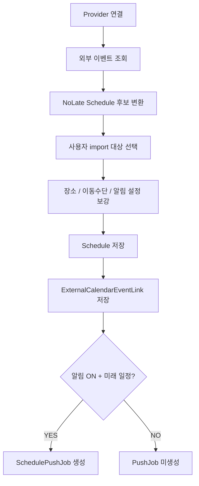
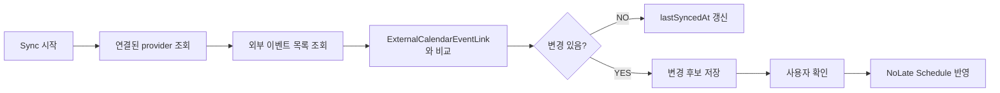
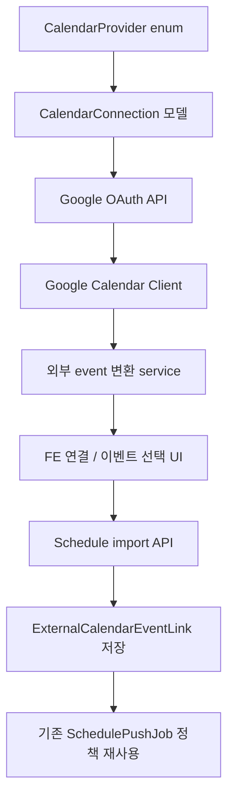

# External Calendar Integration Roadmap

Last verified: 2026-06-17 KST

Google Calendar, Apple Calendar처럼 사용자가 이미 쓰고 있는 외부 캘린더의 일정을 NoLate로 가져오는 기능의 상세 로드맵이다.

상위 로드맵에서는 전체 흐름만 관리한다.

- `docs/no-late-codex-roadmaps.md`

## Goal

- 사용자가 기존 캘린더 일정을 NoLate 일정으로 가져올 수 있다.
- 가져온 일정에도 장소, 이동수단, 알림 설정을 추가할 수 있다.
- 외부 일정과 NoLate 일정의 연결 관계를 저장해 중복 import를 막는다.
- NoLate에서 보강한 출발 알림과 ETA 재조회 기능을 외부 일정에도 적용한다.

## Phase 1: Import Only

MVP에서는 양방향 동기화보다 import only가 적절하다. 외부 캘린더 데이터는 가져오되, NoLate에서 수정한 내용을 외부 캘린더에 다시 쓰지는 않는다.

### Google Calendar

- Google OAuth 연결
- Calendar API scope 확정
  - 읽기 전용으로 시작 권장
- Google Calendar 이벤트 목록 조회
- 이벤트의 `id`, `calendarId`, `etag`, `updated`, `summary`, `description`, `location`, `start`, `end` 매핑
- location이 있으면 NoLate 장소 후보로 변환
- start/end가 있는 이벤트만 import 대상으로 노출
- all-day event 처리 정책 결정

### Apple Calendar

- iOS/Apple Calendar는 우선 기기 캘린더 접근 방식 검토
- React Native/Expo 계열에서 native calendar permission과 event read API 사용 가능성 확인
- iCloud Calendar 서버 동기화는 CalDAV 또는 별도 계정 인증 이슈가 있어 MVP 범위에서는 뒤로 둔다.
- Android에서는 Google Calendar 중심으로 먼저 구현하고, iOS에서는 기기 캘린더 read/import를 우선 검토한다.

### Import Flow

- 외부 이벤트를 NoLate `Schedule` 후보로 변환
- 사용자가 가져올 일정을 선택
- 사용자가 장소/이동수단/알림 설정을 보강
- 가져온 일정은 NoLate `Schedule`로 저장
- 외부 일정 ID, provider, calendarId, eventId 저장
- 같은 외부 event 중복 import 방지
- import된 일정에도 기존 SchedulePushJob 생성 정책 적용

<!-- mermaidId: external-calendar-import-flow -->

## Phase 2: One-way Sync

외부 캘린더 변경사항을 NoLate로 가져오는 단계다. NoLate에서 외부 캘린더로 쓰지는 않는다.

- 사용자가 연결한 캘린더를 주기적으로 재조회
- 외부 일정의 시간/제목/장소 변경 감지
- NoLate 일정에 반영할지 사용자에게 확인
- 외부 일정 삭제 시 NoLate 일정 처리 정책 결정
  - 자동 삭제
  - 보관
  - 연결 해제
- sync 실패 상태 저장
- OAuth 권한 만료 상태 표시
- 수동 sync 버튼 제공

<!-- mermaidId: external-calendar-one-way-sync -->

## Phase 3: Two-way Sync

NoLate에서 수정한 일정 정보를 외부 캘린더에 반영하는 단계다. 충돌 해결과 반복 일정 때문에 가장 늦게 진행하는 것이 좋다.

- NoLate에서 수정한 일정 정보를 외부 캘린더에 반영
- 충돌 해결 정책
  - 외부 우선
  - NoLate 우선
  - 사용자 선택
- 반복 일정 처리
- 참석자/초대/공유 일정 처리
- 캘린더별 동기화 ON/OFF
- 외부 캘린더 write 실패 재시도

## BE Candidate Model

### CalendarConnection

- `id`
- `memberId`
- `provider`
  - `GOOGLE`
  - `APPLE_DEVICE`
  - `CALDAV`
- `externalAccountId`
- encrypted `accessToken`
- encrypted `refreshToken`
- `scope`
- `status`
  - `ACTIVE`
  - `EXPIRED`
  - `REVOKED`
  - `FAILED`
- `lastSyncedAt`
- `createdAt`
- `updatedAt`

### ExternalCalendarEventLink

- `id`
- `memberId`
- `scheduleId`
- `connectionId`
- `provider`
- `calendarId`
- `eventId`
- `etag`
- external `updatedAt`
- `syncStatus`
  - `IMPORTED`
  - `CHANGED`
  - `DELETED_EXTERNALLY`
  - `CONFLICT`
  - `DISCONNECTED`
- `createdAt`
- `updatedAt`

## API Candidate

- `GET /api/calendar-connections`
- `POST /api/calendar-connections/google/oauth-url`
- `POST /api/calendar-connections/google/callback`
- `DELETE /api/calendar-connections/{connectionId}`
- `GET /api/external-calendars/{connectionId}/events`
- `POST /api/external-calendars/events/import`
- `POST /api/external-calendars/sync`
- `GET /api/external-calendars/changes`
- `POST /api/external-calendars/changes/{changeId}/apply`
- `POST /api/external-calendars/changes/{changeId}/ignore`

## FE Candidate Screen

- 캘린더 연결 설정 화면
- Google Calendar 연결 버튼
- Apple Calendar 권한 요청 버튼
- 가져올 일정 선택 화면
- 외부 일정 import preview
- 장소/이동수단/알림 보강 화면
- 외부 일정 동기화 상태 표시
- 권한 만료 재연결 UI
- sync 충돌 해결 화면

## Conversion Rules

- 외부 `summary` -> NoLate `title`
- 외부 `description` -> NoLate `memo`
- 외부 `location` -> NoLate destination 후보
- 외부 `start.dateTime` -> NoLate `startAt`
- 외부 `end.dateTime` -> NoLate `endAt`
- 외부 all-day event는 기본적으로 import 후보에서 제외하거나 사용자가 시간을 지정하게 한다.
- 외부 timezone은 provider timezone을 우선 사용하고, 없으면 사용자 timezone을 사용한다.
- 장소 좌표가 없는 경우 FE/BE 장소 검색을 통해 좌표를 보강한다.

## Test Candidate

- 외부 event를 NoLate Schedule DTO로 변환
- all-day event 처리
- timezone 변환
- 중복 event import 방지
- OAuth token 만료 시 refresh
- 연결 해제 시 token 삭제/폐기
- 같은 외부 일정의 시간 변경 감지
- 외부 일정 삭제 감지
- 반복 일정의 단일 인스턴스 처리
- provider 장애 시 사용자에게 재시도 가능 상태 반환
- import된 일정에 PushJob 생성 정책 적용
- 외부 일정이 과거 일정이면 Schedule은 저장하되 PushJob은 만들지 않음

## Open Decisions

- Google OAuth를 FE 주도 흐름으로 할지 BE 주도 callback으로 할지 결정 필요
- Apple Calendar를 기기 캘린더 import로 시작할지 CalDAV까지 MVP에 넣을지 결정 필요
- 외부 일정 변경 시 NoLate 일정을 자동 수정할지 사용자 승인 후 수정할지 결정 필요
- 외부 일정 삭제 시 NoLate 일정도 삭제할지 연결만 끊을지 결정 필요
- 반복 일정은 전체 series를 가져올지 개별 instance만 가져올지 결정 필요
- import된 일정의 기본 알림 설정을 사용자 기본값으로 할지 import 화면에서 매번 설정하게 할지 결정 필요

## Suggested First Implementation Slice

1. `CalendarProvider` enum 추가
2. `CalendarConnection` 모델 추가
3. `ExternalCalendarEventLink` 모델 추가
4. Google OAuth URL 발급 API 추가
5. Google OAuth callback API 추가
6. Google 이벤트 목록 조회 client 추가
7. 외부 event -> Schedule 후보 변환 service 추가
8. FE에 Google Calendar 연결 버튼 추가
9. 가져올 일정 선택 UI 추가
10. 선택한 외부 이벤트를 NoLate Schedule로 저장

<!-- mermaidId: external-calendar-first-slice -->

