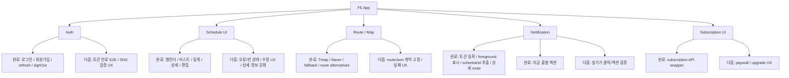

# FE App / Route UX Roadmap

Last verified: 2026-06-25 KST

React Native/Expo 앱, 인증 상태, 일정 화면, 지도/경로 선택, 앱 알림 UX의 상세 로드맵이다.

상위 로드맵:

- `docs/no-late-codex-roadmaps.md`

## Current Status

### 앱 라우팅 완료

- 로그인
- 회원가입
- 프로필
- 일정 메인
- 일정 상세
- 일정 편집
- 경로 플래너
- 경로 선택
- 시간표

### API wrapper 완료

- member
- schedule
- notification
- subscription

### 인증 상태 관리 완료

- `AuthContext`
- SecureStore 기반 token storage
- refresh interceptor
- signOut

### 일정 UX 완료

- 캘린더
- 일정 리스트
- 스택형/목록형/상세형 보기 모드
- 빠른 일정 추가 모달
- 일정 등록 모달
- 카테고리 선택
- 위치 입력
- 즐겨찾는 출발지 저장/재사용
- 알림 설정 카드

### 지도/경로 완료

- 현재 위치 조회 helper
- Tmap 기반 장소/경로 API
- Naver map API wrapper
- OSRM/직선거리 fallback
- 자동차/대중교통/도보/자전거/기타 모드별 경로 후보
- 선택 경로 정보를 일정 저장 payload로 전달

### 알림 UX 완료

- Android/iOS 공통 `scheduleId` payload 파싱
- 알림 클릭 시 `/schedule/[id]` route 생성
- foreground push를 local notification으로 표시
- `departNow=true` 일정 알림에 `지금 출발` 액션 연결
- `지금 출발` 액션에서 출발 처리 API 호출
- iOS TestFlight build 24 업로드

### 주요 구현 파일

- `NoLate_FE/app/_layout.tsx`
- `NoLate_FE/app/index.tsx`
- `NoLate_FE/app/auth/login.tsx`
- `NoLate_FE/app/auth/signup.tsx`
- `NoLate_FE/app/schedule/index.tsx`
- `NoLate_FE/app/schedule/[id].tsx`
- `NoLate_FE/app/schedule/route-planner.tsx`
- `NoLate_FE/app/schedule/route-select.tsx`
- `NoLate_FE/src/AppProviders.tsx`
- `NoLate_FE/src/api/api.ts`
- `NoLate_FE/src/api/member.ts`
- `NoLate_FE/src/api/schedule.ts`
- `NoLate_FE/src/api/notification.ts`
- `NoLate_FE/src/api/subscription.ts`
- `NoLate_FE/src/modules/auth/AuthContext.tsx`
- `NoLate_FE/src/modules/schedule/calendarRange.ts`
- `NoLate_FE/src/modules/map/tmapApi.ts`
- `NoLate_FE/src/modules/map/naverMapApi.ts`
- `NoLate_FE/src/modules/notification/foregroundPush.ts`
- `NoLate_FE/src/modules/notification/pushRegistration.ts`
- `NoLate_FE/src/modules/notification/pushNavigation.ts`

### 테스트

- `NoLate_FE/__tests__/apiWrappers.test.ts`
- `NoLate_FE/__tests__/calendarRange.test.ts`
- `NoLate_FE/__tests__/App.test.tsx`

## Next Work

- 알림 클릭 후 일정 상세 이동 실기기 검증
- push payload type별 문구/상태 UX 세부 정리
- 일정 상세에서 경로/ETA 표시 완성
- 일정 수정 시 기존 routeJson 유지/교체 UX 명확화
- 경로 API 실패 시 사용자 메시지 정리
- 지도 API key 미설정 시 개발자용 오류 메시지 정리
- 로딩/빈 상태/오류 상태 UI 정리
- 접근성
  - 버튼 label
  - 스크린 리더
  - 색 대비
- 앱 최초 실행/로그아웃/토큰 만료 흐름 E2E 검증
- Android/iOS 권한 요청 UX 정리
- routeJson FE/BE 계약 문서화

## Roadmap

<!-- mermaidId: fe-app-route-roadmap -->

## Suggested First Slice

1. TestFlight build 24에서 `SCHEDULE_TRAFFIC` / `SCHEDULE_DEPARTURE_REMINDER` 클릭 상세 이동 확인
2. `departNow=true` 알림의 `지금 출발` 액션 확인
3. 일정 상세 화면에 route/ETA 요약 표시
4. routeJson payload 계약 문서화
5. API 실패/빈 상태 UI 정리
