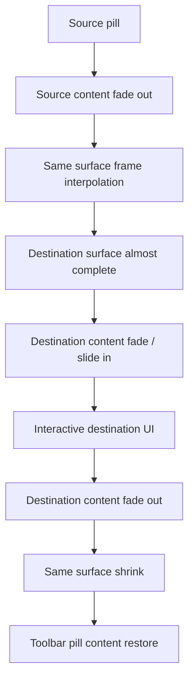

# Liquid Glass Pill Morphing Guide

Last verified: 2026-07-03 KST

NoLate 일정 목록 상단의 Liquid Glass pill, 드롭다운, 검색창, 빠른 일정, 일정 등록 morphing 작업에서 발생했던 문제와 해결 방식을 정리한다.

이 문서의 목적은 다음이다.

- 같은 pill UI를 수정할 때 반복해서 깨지는 지점을 피한다.
- "버튼 옆에 새 카드가 뜨는 느낌"이 아니라 "pill 자체가 변형되는 느낌"을 유지한다.
- open / close / handoff 애니메이션을 프레임 단위로 검증하는 기준을 고정한다.
- 빠른 일정, 일정 등록, 검색, 보기 드롭다운이 같은 visual language를 공유하게 한다.

## 관련 구현 파일

### React Native

- `NoLate_FE/app/schedule/index.tsx`
  - 일정 목록 화면의 toolbar 상태, 검색/보기/등록 메뉴 상태, modal handoff 상태를 관리한다.
  - `activeToolbarMenu`, `toolbarDropdownProgress`, `searchToolbarProgress`
  - `prototypeTapRequest`, `prototypeCloseRequest`, `prototypeAddMenuRequest`, `prototypeQuickAddRequest`, `prototypeManualAddRequest`
  - `quickModalSource`, `scheduleModalSource`
  - `handleQuickModalCloseStart`
- `NoLate_FE/src/modules/schedule/components/form/QuickScheduleModal.tsx`
  - 빠른 일정 생성 modal의 pill-to-modal morphing 구현.
  - source pill frame에서 modal frame으로 직접 보간한다.
- `NoLate_FE/src/modules/schedule/components/form/ScheduleAddModal.tsx`
  - 직접 일정 등록 modal의 pill-to-modal morphing 구현.
  - 빠른 일정과 동일한 source handoff 구조를 사용해야 한다.
- `NoLate_FE/src/modules/schedule/components/calendar/LiquidCalendarMenuPrototype.tsx`
  - native Liquid Glass control을 RN에서 감싸는 wrapper.
  - 보기/검색/등록 pill의 native event와 programmatic request를 연결한다.
- `NoLate_FE/src/modules/schedule/components/calendar/LiquidGlassIconButton.tsx`
  - 단일 pill 버튼 wrapper.
- `NoLate_FE/src/modules/schedule/components/calendar/LiquidGlassSegmentedPill.tsx`
  - segmented pill wrapper.
- `NoLate_FE/src/modules/schedule/components/calendar/CalendarGlassSurface.tsx`
  - Liquid Glass 사용 가능 여부와 fallback surface 스타일을 관리한다.

### iOS Native

- `NoLate_FE/ios/NoLateFE/ViewModeGlassControlView.swift`
  - 상단 3개 pill의 실제 Liquid Glass surface, dropdown, search handoff, add menu handoff를 구현한다.
  - `ViewModeGlassControlRootView`
  - `SharedLiquidGlassPillSurface`
  - `triggerRequestedAddAction`
  - `closeMenu`
- `NoLate_FE/ios/NoLateFE/ViewModeGlassControlManager.m`
  - RN prop과 native view property bridge.
  - `quickAddRequest`, `manualAddRequest`를 native에 전달한다.

## 우리가 겪은 핵심 문제

### 1. surface가 변형되는 것이 아니라 새 카드가 삽입되어 보였다

처음 구현은 아래 구조에 가까웠다.

```text
collapsed button surface
if open:
  expanded card surface
content layer
```

이 구조에서는 open 순간에 이미 최종 크기의 rounded rectangle이 렌더링된다. content만 늦게 뜨게 해도 배경 surface는 먼저 큰 빈 카드로 보인다. 그래서 사용자는 "pill이 메뉴가 됐다"가 아니라 "pill 옆에 카드가 하나 생겼다"고 느낀다.

해결:

- collapsed와 expanded를 별도 branch로 교체하지 않는다.
- source pill frame과 destination modal frame 사이를 하나의 visual object가 직접 보간한다.
- content는 surface morph가 충분히 진행된 뒤 mount/fade in 한다.

### 2. 검색창이 pill에서 만들어지는 느낌이 약했다

검색 클릭 시 기존 toolbar가 먼저 사라지고 다른 검색 pill이 새로 나타났다. 특히 중간에 pill이 살짝 줄어든 뒤 다시 늘어나는 프레임이 있어 "뚝 끊김"처럼 보였다.

원인:

- 검색 open 전 toolbar 레이아웃이 먼저 재계산됐다.
- source pill과 search field가 다른 view identity를 가졌다.
- close icon 또는 input content가 너무 일찍 등장해서 layout shift처럼 보였다.
- 일정 목록 header가 함께 변하면서 배경이 번쩍이는 느낌을 만들었다.

해결:

- 기존 pill의 frame을 유지한 상태에서 width만 확장되도록 했다.
- 검색창은 toolbar 위에 overlay처럼 올라오게 하고, 아래 일정 목록 layout은 되도록 바꾸지 않는다.
- 아이콘과 기존 content는 옆으로 밀려나지 않고 제자리에서 fade out되게 했다.
- close/search text는 morph 후반부에만 나타나게 했다.

### 3. 빠른 일정 / 일정 등록 open이 1초 늦게 반응하는 느낌이었다

원인:

- RN modal open 전에 native dropdown close delay, RN `setTimeout`, content mount delay가 누적됐다.
- close/open 과정에 `requestAnimationFrame`이 끼어 있어 첫 프레임 반응이 밀렸다.
- native `triggerRequestedAddAction`에서 programmatic handoff delay가 길었다.
- content mount delay가 surface morph delay와 별도로 누적되어 실제 반응이 늦게 보였다.

해결:

- `QuickScheduleModal` / `ScheduleAddModal`에서 close 시작 전 `requestAnimationFrame`을 제거했다.
- morph duration, content mount delay, toolbar restore delay를 줄였다.
- native `triggerRequestedAddAction` follow-up delay를 줄였다.
- 클릭 후 0.1초 안에 surface motion이 시작되도록 QA 기준을 세웠다.

### 4. open 중 dropdown menu content가 사라졌다가 다시 나왔다가 사라졌다

빠른 일정 또는 직접 입력을 클릭하면 dropdown 안의 메뉴 텍스트가 중간 프레임에서 다시 보이는 문제가 있었다. 이 때문에 실제 surface morph가 맞아도 시각적으로 "끊김"처럼 느껴졌다.

원인:

- dropdown content opacity와 modal seed content opacity가 서로 다른 상태에서 동시에 관리됐다.
- `sourceContent`가 `addMenu`인 상태에서 open/close seed가 다시 toolbar content를 그리는 타이밍이 있었다.
- close와 open handoff 상태가 분리되어, "이전 dropdown", "새 modal", "toolbar seed"가 잠깐 공존했다.

해결:

- modal로 handoff되는 순간 dropdown 내부 메뉴 content는 즉시 seed에서 제외한다.
- surface만 남기고 content는 fade out, modal content는 후반에 fade in한다.
- closing visual에서는 toolbar icon seed를 너무 늦게 복구하지 않도록 delay를 줄인다.

### 5. 닫을 때 상단 3개 아이콘이 늦게 복구되거나 뭉개졌다

원인:

- modal close animation이 끝난 뒤 toolbar restore가 시작됐다.
- restore delay가 close duration보다 길거나 비슷해서 사용자가 빈 pill을 본다.
- native toolbar seed와 RN toolbar state가 서로 다른 타이밍으로 복구됐다.

해결:

- `onCloseStart`에서 toolbar restore 예약을 close 시작과 동시에 걸었다.
- restore delay는 실제 close duration보다 짧거나 비슷하게 맞췄다.
- 닫힐 때 content는 먼저 fade out, surface는 줄어들고, toolbar icons는 마지막에 너무 늦지 않게 복구한다.

## 현재 목표 구조

pill 계열 motion은 아래 순서를 지켜야 한다.



중요한 점:

- source와 destination은 별도 카드처럼 보이면 안 된다.
- content와 surface가 무관하게 따로 놀면 안 된다.
- open 순간 destination full-size card를 먼저 렌더링하면 안 된다.
- close 순간 source toolbar icon 복구가 너무 늦으면 안 된다.

## 구현 원칙

### 1. 단일 visual object를 기준으로 보간한다

좋은 구조:

```text
sourceFrame
targetFrame
morphProgress 0 -> 1

surface.left   = interpolate(progress, source.left, target.left)
surface.top    = interpolate(progress, source.top, target.top)
surface.width  = interpolate(progress, source.width, target.width)
surface.height = interpolate(progress, source.height, target.height)
radius         = interpolate(progress, source.radius, target.radius)
```

나쁜 구조:

```text
if isOpen:
  render expanded card
else:
  render collapsed pill
```

이 구조는 거의 항상 "새 card가 생긴다"는 인상을 만든다.

### 2. source frame을 정확히 넘긴다

빠른 일정과 일정 등록은 `app/schedule/index.tsx`에서 source 정보를 modal로 넘긴다.

```text
quickModalSource
scheduleModalSource

sourceTopOffset
sourceWidth
sourceHeight
sourceContent
```

주의:

- source frame이 실제 pill frame과 다르면 open 첫 프레임에서 튄다.
- toolbar pill padding을 바꾸면 sourceWidth/sourceHeight도 같이 재검토한다.
- 등록 dropdown에서 modal로 handoff할 때는 `sourceContent = "addMenu"` 경로가 깨지기 쉽다.

### 3. content mount는 surface morph 후반에 한다

surface motion과 content motion은 분리한다.

권장:

- `morphProgress < 0.65`: destination content 숨김
- `morphProgress 0.70 ~ 1.0`: destination content fade + slight slide in
- close 시: content fade out 먼저, surface shrink 다음

이유:

- content가 너무 빨리 보이면 "빈 카드 위에 텍스트가 올라오는 느낌"이 난다.
- X 버튼, rows, input, CTA가 surface보다 먼저 보이면 modal/card처럼 느껴진다.

### 4. source content는 이동시키지 말고 제자리 fade out한다

특히 검색과 toolbar icon에서 중요하다.

나쁜 느낌:

- 아이콘이 옆으로 빠르게 밀려나며 사라짐
- 기존 pill content가 layout change 때문에 좌우로 흔들림
- close icon이 너무 일찍 나타나 layout이 바뀜

좋은 느낌:

- source icons/text는 제자리에서 opacity만 줄어든다.
- destination content는 surface가 충분히 커진 뒤 제자리에서 나타난다.
- 검색 input은 pill surface 내부에서 완성되는 것처럼 보인다.

### 5. dropdown content는 modal handoff 순간 다시 나타나면 안 된다

빠른 일정, 일정 생성, 카테고리 버튼이 있는 add dropdown은 handoff가 특히 예민하다.

금지:

- 빠른일정 클릭
- dropdown menu text 사라짐
- modal open 중 dropdown menu text가 다시 나타남
- 다시 사라짐

이 프레임이 보이면 사용자는 motion이 끊긴다고 느낀다.

권장:

- click 직후 dropdown content opacity를 0으로 고정한다.
- handoff surface만 남긴다.
- modal content는 후반에 mount한다.

### 6. 닫기에서는 toolbar 복구가 너무 늦으면 안 된다

닫기 순서:

1. destination content fade out
2. surface shrink 시작
3. toolbar pill frame에 가까워질 때 icon seed 복구
4. modal unmount

나쁜 순서:

1. destination content fade out
2. surface shrink 완료
3. 빈 pill 유지
4. 한참 뒤 toolbar icon 복구

## Timing 기준

실제 값은 디자인 QA에 따라 바뀔 수 있지만, 아래 범위를 넘기면 다시 느려 보일 가능성이 높다.

| 항목 | 권장 범위 | 주의 |
| --- | ---: | --- |
| 클릭 후 surface motion 시작 | 0 ~ 100ms | 100ms를 넘으면 주춤거린다 |
| dropdown -> modal handoff delay | 120 ~ 220ms | 300ms 이상이면 늦게 반응한다 |
| pill -> modal open duration | 380 ~ 480ms | 560ms 이상이면 무겁다 |
| modal close duration | 280 ~ 380ms | close는 open보다 약간 빠르게 |
| content mount delay | 200 ~ 280ms | surface보다 먼저 뜨면 안 된다 |
| toolbar restore delay | 220 ~ 320ms | close 완료 뒤 복구하면 늦다 |

현재 기준값:

- `QuickScheduleModal`
  - open: 약 420ms
  - close: 약 300ms
  - content mount: 약 220ms
  - content open delay: 약 260ms
- `ScheduleAddModal`
  - open: 약 420ms
  - close: 약 340ms
  - content mount: 약 240ms
- `app/schedule/index.tsx`
  - quick close restore: 약 260ms
  - schedule close restore: 약 300ms
- `ViewModeGlassControlView.swift`
  - native action handoff delay는 200ms 안쪽을 목표로 한다.

## QA 기준

### 반드시 영상으로 확인할 것

단일 스크린샷만으로는 pill motion 문제를 잡기 어렵다. 다음 상황은 반드시 영상으로 확인한다.

- 보기 dropdown open / close
- 검색창 open / close
- 등록 dropdown open / close
- 등록 dropdown -> 빠른 일정 open
- 빠른 일정 close
- 등록 dropdown -> 일정 등록 open
- 일정 등록 close
- 다크모드에서 동일 플로우

### 프레임 분석 기준

가능하면 60fps 이상, 미세한 끊김을 볼 때는 120프레임 단위로 확인한다.

체크 포인트:

- 클릭 후 0.1초 안에 surface가 움직이는가?
- open 첫 프레임에서 pill이 살짝 줄어들었다가 늘어나지 않는가?
- dropdown content가 사라졌다가 다시 나타나지 않는가?
- source pill과 destination modal이 서로 다른 두 물체처럼 보이지 않는가?
- destination full-size card가 먼저 나타나지 않는가?
- close 시 toolbar icons가 너무 늦게 복구되지 않는가?
- close 시 icons가 뭉개지거나 중복되어 보이지 않는가?
- 검색 open 시 일정 목록 header나 배경이 갑자기 바뀌지 않는가?
- 다크모드에서 glass가 단순 투명 레이어처럼 보이지 않는가?

### 시뮬레이터 캡처 명령 예시

```bash
# 앱 실행
xcrun simctl launch <UDID> com.anonymous.nolatefe

# QA 딥링크로 일정 등록 morph 열기
xcrun simctl openurl <UDID> "nolate:///schedule?qaSurface=manual-add-morph&qaRun=$(date +%s)"

# 스크린샷
xcrun simctl io <UDID> screenshot /tmp/nolate-pill-qa.png

# 영상 녹화
xcrun simctl io <UDID> recordVideo /tmp/nolate-pill-qa.mov
```

## 흔한 회귀 패턴

### 1. padding만 바꿨는데 morph가 깨짐

pill width/height가 바뀌면 source frame도 바뀐다. padding 수정 후에는 다음을 확인한다.

- native pill actual width
- RN `sourceWidth`
- dropdown width
- modal source frame
- close restore frame

### 2. content delay만 바꿨는데 빈 카드가 다시 보임

content delay는 surface 구조 문제를 해결하지 못한다. 큰 빈 카드가 보이면 다음을 먼저 확인한다.

- expanded card가 open 즉시 mount되는지
- background surface가 최종 frame으로 먼저 렌더링되는지
- content만 늦게 뜨는 구조인지

### 3. close는 자연스러운데 open만 이상함

open과 close가 같은 path를 타는지 확인한다.

- open은 dropdown -> modal handoff
- close는 modal -> toolbar restore

두 방향의 source content, seed content, restore delay가 서로 다르면 한쪽만 자연스럽게 보인다.

### 4. 딥링크 QA와 실제 클릭 결과가 다름

QA 딥링크는 request counter를 직접 올릴 수 있다. 실제 클릭은 native touch, dropdown open, item select, RN modal state까지 모두 거친다.

따라서 최종 QA는 반드시 실제 클릭으로 한 번 더 확인한다.

## 새 pill 기능을 추가할 때 체크리스트

1. source pill frame을 어디서 측정할지 정한다.
2. destination frame을 source anchor 기준으로 계산한다.
3. source와 destination을 branch swap으로 나누지 않는다.
4. surface는 progress 기반으로 직접 보간한다.
5. source content는 제자리 fade out한다.
6. destination content는 morph 후반에 mount/fade in한다.
7. close 시 destination content를 먼저 숨긴다.
8. close 시작과 동시에 toolbar restore 예약을 건다.
9. dropdown content가 handoff 중 다시 나타나지 않게 한다.
10. 60fps 이상 영상으로 open/close를 확인한다.
11. 다크모드에서 glass 굴절, contrast, input background를 확인한다.
12. padding, icon size, text 유무 변경 후 source frame을 다시 확인한다.

## 결론

NoLate의 pill motion에서 중요한 것은 duration 숫자보다 view hierarchy와 identity다.

성공하는 구조:

- 하나의 visual surface가 source pill에서 destination UI로 변한다.
- content는 surface의 자식처럼 보이고, morph 후반에만 등장한다.
- source frame, target frame, restore frame이 같은 좌표계에서 관리된다.
- open과 close 모두 같은 handoff 철학을 따른다.

실패하는 구조:

- collapsed pill과 expanded card를 별도 surface로 둔다.
- open 순간 destination card를 최종 크기로 mount한다.
- content, background, dim layer가 서로 다른 타이밍으로 따로 나타난다.
- dropdown content가 handoff 중 재등장한다.
- toolbar icon 복구가 close 완료 뒤 늦게 일어난다.

앞으로 pill 관련 UI를 수정할 때는 "더 빠르게"보다 먼저 "같은 object로 보이는가"를 확인해야 한다.
