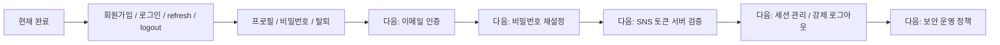

# Member / Auth / Profile Roadmap

Last verified: 2026-06-17 KST

회원가입, 로그인, 토큰 재발급, 프로필, 비밀번호, 탈퇴 기능의 상세 로드맵이다.

상위 로드맵:

- [`../roadmap.md`](../roadmap.md)

## Current Status

### 완료

- COMMON 회원가입
- COMMON 로그인
- SNS 로그인 진입 API
- refresh token 기반 token-login
- access/refresh token 재발급
- logout 시 refresh token revoke
- 내 프로필 조회
- 내 프로필 수정
- COMMON 계정 비밀번호 변경
- 회원 탈퇴
  - refresh token 삭제
  - member setting soft delete
  - member soft delete
- 회원가입 시 기본 member setting 생성
- 회원가입 시 기본 profile 생성

### 주요 구현 파일

- `src/main/kotlin/com/noLate/member/contoller/MemberController.kt`
- `src/main/kotlin/com/noLate/member/application/useCase/MemberUseCase.kt`
- `src/main/kotlin/com/noLate/member/application/service/MemberValidation.kt`
- `src/main/kotlin/com/noLate/member/application/service/MemberService.kt`
- `src/main/kotlin/com/noLate/member/application/service/MemberProfileService.kt`
- `src/main/kotlin/com/noLate/member/application/service/MemberSettingService.kt`
- `src/main/kotlin/com/noLate/auth/application/RefreshTokenService.kt`
- `src/main/kotlin/com/noLate/global/security/JwtTokenProvider.kt`

### 테스트

- `src/test/kotlin/com/noLate/member/application/MemberUseCaseUnitTest.kt`
- `src/test/kotlin/com/noLate/member/application/MemberUseCaseIntegrationTest.kt`
- `src/test/kotlin/com/noLate/member/controller/MemberControllerTest.kt`
- `src/test/kotlin/com/noLate/global/security/JwtTokenProviderTest.kt`

## Next Work

- 이메일 인증
- 비밀번호 재설정
- SNS access token을 BE에서 검증
  - 현재 구조는 `snsId`를 전달받아 처리하는 흐름에 가깝다.
- COMMON/SNS 계정 연결 정책
- 중복 이메일과 SNS 계정 충돌 정책
- 다중 기기 세션 관리
- refresh token 목록 조회/강제 로그아웃
- 회원 탈퇴 후 복구 가능 기간 정책
- 프로필 이미지 업로드/삭제
- 로그인 실패 rate limit
- 인증/회원 이벤트 audit log

## Roadmap

<!-- mermaidId: member-auth-roadmap -->

## Suggested First Slice

1. 이메일 인증 토큰 모델 추가
2. 인증 메일 발송 abstraction 추가
3. 회원가입 후 이메일 인증 요청 API 추가
4. 이메일 인증 완료 API 추가
5. 미인증 계정 로그인 정책 결정
6. 이메일 인증 테스트 추가
