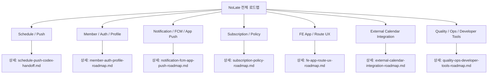

# NoLate Codex Roadmaps

Last verified: 2026-06-17 KST

이 문서는 NoLate 기능 로드맵의 상위 인덱스다. 각 도메인의 구체적인 설계, 완료 범위, 다음 작업, 테스트 후보는 개별 md 파일에서 관리한다.

## Roadmap Index

| Area | Detail Document | Current Status | Next Focus |
| --- | --- | --- | --- |
| Schedule / Push | `docs/schedule-push-codex-handoff.md` | 1~2단계 완료, 3단계 BE 핵심 완료 | FE payload 처리, 실제 FCM E2E, 운영 안정화 |
| Member / Auth / Profile | `docs/member-auth-profile-roadmap.md` | 회원가입, 로그인, refresh, 프로필, 비밀번호, 탈퇴 완료 | 이메일 인증, 비밀번호 재설정, SNS 토큰 검증 |
| Notification / FCM / App Push | `docs/notification-fcm-app-push-roadmap.md` | 토큰 등록, Firebase/Dummy PushClient, FE foreground 수신 기반 완료 | payload별 라우팅, 알림 클릭 상세 이동, 알림 액션 |
| Subscription / Policy | `docs/subscription-policy-roadmap.md` | FREE/PREMIUM 정책 모델, 내 정책 조회, 일정 정책 검증 완료 | 결제/구독 모델, plan 변경, paywall |
| FE App / Route UX | `docs/fe-app-route-ux-roadmap.md` | 로그인, 일정 화면, 경로 선택, API wrapper, 지도 fallback 기반 완료 | UX 상태 정리, routeJson 계약, 알림 이동 연결 |
| External Calendar Integration | `docs/external-calendar-integration-roadmap.md` | 로드맵 단계 정의 | Google/Apple import MVP 설계 |
| Quality / Ops / Developer Tools | `docs/quality-ops-developer-tools-roadmap.md` | BE/FE 테스트 일부, HTTP Client 검증 파일, 문서화 기반 완료 | CI, 환경변수 문서, 관측성, E2E 체크리스트 |

## Roadmap Overview

<!-- mermaidId: no-late-roadmap-overview -->



## Suggested Work Order

1. FE push payload 라우팅 완성
2. 알림 클릭 시 일정 상세 이동 실기기 검증
3. routeJson FE/BE 계약 문서화
4. External Calendar Integration 1단계 설계
   - Google Calendar import
   - Apple Calendar 또는 기기 캘린더 import
   - 외부 event와 NoLate Schedule 매핑
5. Member/Auth 보안 보강
   - 비밀번호 재설정
   - 이메일 인증
   - 로그인 rate limit
6. Subscription plan 변경과 paywall 설계
7. CI와 환경변수 문서화
8. 실제 Firebase/Tmap/Groq/Google Calendar 외부 연동 테스트 분리 실행

## Verification Commands

자세한 테스트/운영 검증 명령은 `docs/quality-ops-developer-tools-roadmap.md`에서 관리한다.

BE:

```powershell
cd D:\DevSpace\application\no-late\NoLate_BE
.\gradlew.bat --no-daemon test
```

FE:

```powershell
cd D:\DevSpace\application\no-late\NoLate_FE
npm test -- --runInBand
npx tsc --noEmit
```
