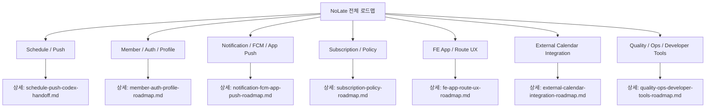

# NoLate Codex Roadmaps

Last verified: 2026-06-25 KST

이 문서는 NoLate 기능 로드맵의 상위 인덱스다. 각 도메인의 구체적인 설계, 완료 범위, 다음 작업, 테스트 후보는 개별 md 파일에서 관리한다.

## Roadmap Index

| Area | Detail Document | Current Status | Next Focus |
| --- | --- | --- | --- |
| Schedule / Push | `docs/schedule-push-codex-handoff.md` | 4단계 완료, 5단계 진행 중 | iOS 실기기 acceptance, 운영 BE 배포 검증, 중복 발송 방지 |
| Member / Auth / Profile | `docs/member-auth-profile-roadmap.md` | 회원가입, 로그인, refresh, 프로필, 비밀번호, 탈퇴 완료 | 이메일 인증, 비밀번호 재설정, SNS 토큰 검증 |
| Notification / FCM / App Push | `docs/notification-fcm-app-push-roadmap.md` | payload 라우팅, 상세 이동 규칙, `지금 출발` 액션 완료 | iOS/Android 실기기 E2E, 권한/토큰 복구 UX |
| Subscription / Policy | `docs/subscription-policy-roadmap.md` | FREE/PREMIUM 정책 모델, 내 정책 조회, 일정 정책 검증 완료 | 결제/구독 모델, plan 변경, paywall |
| FE App / Route UX | `docs/fe-app-route-ux-roadmap.md` | 로그인, 일정/경로, 프로필, 알림 이동/액션 기반 완료 | 실기기 UX 검증, 권한/빈/오류 상태 정리 |
| External Calendar Integration | `docs/external-calendar-integration-roadmap.md` | 로드맵 단계 정의 | Google/Apple import MVP 설계 |
| Quality / Ops / Developer Tools | `docs/quality-ops-developer-tools-roadmap.md` | BE/FE 테스트 일부, HTTP Client 검증, TestFlight 업로드 경로 확인 | CI, 환경변수 문서, 관측성, E2E 체크리스트 |

## Current Phase Summary

전체 진행은 **4단계 완료, 5단계 진행 중**이다.

1. PushJob 생성/취소 안정화: 완료
2. ETA fallback/복구/재시도 안정화: 완료
3. 실제 FCM 발송과 발송 이력 관리: 완료
4. FE payload 라우팅, 상세 이동 규칙, `지금 출발` 액션: 완료
5. 실기기 E2E와 운영 안정화: 진행 중

## Roadmap Overview

<!-- mermaidId: no-late-roadmap-overview -->



## Suggested Work Order

1. iPhone TestFlight build 21에서 실제 일정 푸시 수신과 알림 터치 상세 이동 검증
2. 운영 BE에 `depart-now` API와 최신 푸시 문구 배포 확인
3. routeJson FE/BE 계약 문서화
4. 발송 이벤트 단위 중복 방지(outbox 또는 idempotency key) 설계
5. External Calendar Integration 1단계 설계
   - Google Calendar import
   - Apple Calendar 또는 기기 캘린더 import
   - 외부 event와 NoLate Schedule 매핑
6. Member/Auth 보안 보강
   - 비밀번호 재설정
   - 이메일 인증
   - 로그인 rate limit
7. Subscription plan 변경과 paywall 설계
8. CI와 환경변수 문서화
9. 실제 Firebase/Tmap/Groq/Google Calendar 외부 연동 테스트 분리 실행

## Verification Commands

자세한 테스트/운영 검증 명령은 `docs/quality-ops-developer-tools-roadmap.md`에서 관리한다.

BE:

```powershell
cd D:\DevSpace\application\no-late\NoLate_BE
.\gradlew.bat --no-daemon test
```

FE:

```powershell
cd D:\DevSpace\application\no-late\NoLate_FE
npm test -- --runInBand
npx tsc --noEmit
```
