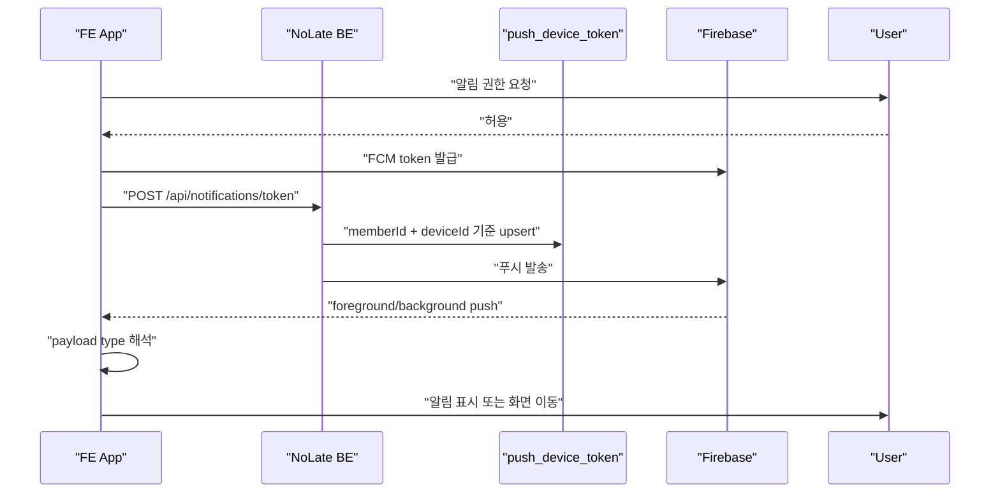

# Notification / FCM / App Push Roadmap

Last verified: 2026-06-17 KST

앱으로 실제 푸시를 보내고, FE 앱이 알림을 수신/표시/이동 처리하는 기반 기능의 상세 로드맵이다.

일정 ETA 기반 푸시 정책은 별도 문서에서 관리한다.

- `docs/schedule-push-codex-handoff.md`

상위 로드맵:

- `docs/no-late-codex-roadmaps.md`

## Current Status

### BE 완료

- `/api/notifications/token` 토큰 등록
- 같은 member/device 토큰 갱신
- 다른 회원에 묶인 token/device 정리
- 회원별 토큰 조회 후 PushClient 전송
- Firebase PushClient
- Dummy PushClient
- invalid token 응답 시 토큰 삭제
- `/api/notifications/test/send` 단일 테스트 전송 API
- `PushScenarioRunner` 개발 검증 도구

### FE 완료

- 로그인 후 FCM 토큰 등록
- deviceId 생성 및 SecureStore 저장
- token refresh 시 BE 재등록
- Android 13+ notification permission 요청
- foreground push를 local notification으로 표시
- 알림 데이터에서 `scheduleId` 추출
- 알림 클릭 시 schedule open callback 연결 지점 마련

### 주요 구현 파일

- `src/main/kotlin/com/noLate/notification/controller/NotificationController.kt`
- `src/main/kotlin/com/noLate/notification/application/useCase/NotificationUseCase.kt`
- `src/main/kotlin/com/noLate/notification/application/service/NotificationTokenService.kt`
- `src/main/kotlin/com/noLate/notification/infrastructure/FirebasePushConfiguration.kt`
- `src/main/kotlin/com/noLate/notification/infrastructure/PushClientApplication.kt`
- `src/main/kotlin/com/noLate/notification/dev/PushScenarioRunner.kt`
- `src/main/kotlin/com/noLate/notification/dev/PushScenarioController.kt`
- `NoLate_FE/src/api/notification.ts`
- `NoLate_FE/src/modules/notification/pushRegistration.ts`
- `NoLate_FE/src/modules/notification/foregroundPush.ts`
- `NoLate_FE/src/modules/notification/pushNavigation.ts`

### 테스트

- `src/test/kotlin/com/noLate/notification/application/service/NotificationServiceUnitTest.kt`
- `src/test/kotlin/com/noLate/notification/application/service/NotificationTokenServiceIntegrationTest.kt`
- `src/test/kotlin/com/noLate/notification/application/useCase/NotificationUseCaseUnitTest.kt`
- `src/test/kotlin/com/noLate/notification/dev/PushScenarioRunnerTest.kt`

## Next Work

- payload `type`별 FE 라우팅 정책 확정
  - `SCHEDULE_TRAFFIC`
  - `SCHEDULE_DEPARTURE_REMINDER`
  - `SCHEDULE_DETAIL`
  - `PUSH_SCENARIO_TOKEN_CHECK`
- background/terminated 상태 알림 클릭 동작 실기기 검증
- 알림 클릭 시 실제 일정 상세 화면 이동 완성
- 알림 액션 버튼
  - "일정 보기"
  - "길찾기"
  - "출발했어요"
- Android notification channel 이름/우선순위/소리 정책 정리
- iOS 권한/foreground 표시 정책 정리
- Firebase credential 운영 환경 분리
- invalid token 삭제 지표/로그 모니터링
- 실제 Firebase E2E 테스트 절차 문서화

## Roadmap

<!-- mermaidId: notification-fcm-app-roadmap -->

## Suggested First Slice

1. FE payload type enum 정리
2. `SCHEDULE_TRAFFIC` 클릭 시 일정 상세 이동
3. foreground 수신 시 동일 payload로 local notification 표시
4. background/terminated 클릭 실기기 테스트
5. PushScenarioRunner로 payload별 수신 검증
