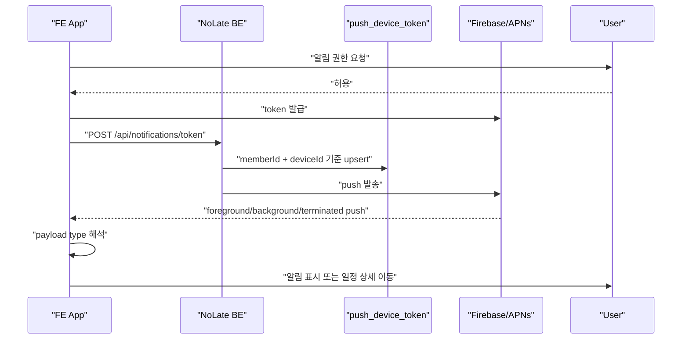

# Notification / FCM / App Push Roadmap

Last verified: 2026-06-26 KST

이 문서는 FCM/APNs 토큰 등록, push 발송, FE 수신/표시/이동 처리의 상태를 관리한다. 일정 ETA 정책은 [`../schedule/PUSH_NOTIFICATION_STATUS.md`](../schedule/PUSH_NOTIFICATION_STATUS.md)를 기준으로 한다.

상위 로드맵:

- [`../roadmap.md`](../roadmap.md)

## Current Status

BE 완료:

- `/api/notifications/token` 토큰 등록
- member/device 기준 token upsert
- 다른 회원에 묶인 token/device 정리
- 회원별 토큰 조회 후 PushClient 발송
- Firebase PushClient와 Dummy PushClient
- Android high priority push, default sound, `schedule-push` channel
- Firebase APNs alert payload
- `departNow=true` 일정 알림의 iOS `schedule_depart_now` category
- invalid token과 `BadEnvironmentKeyInToken` 삭제 처리
- `/api/notifications/test/send`
- `PushScenarioRunner`
- `push_send_history` 발송 이력 저장
- `GET /api/notifications/send-histories`

FE 완료:

- 로그인 후 FCM token 등록
- deviceId 생성 및 SecureStore 저장
- token refresh 시 BE 재등록
- Android 13+ notification permission 요청
- foreground push를 local notification으로 표시
- payload에서 `scheduleId` 추출
- `SCHEDULE_TRAFFIC`, `SCHEDULE_DEPARTURE_REMINDER`, `SCHEDULE_DETAIL` 상세 이동 규칙
- 알림 클릭 시 `/schedule/[id]` route 생성
- `departNow=true` 알림의 출발 완료 액션 연결
- 출발 완료 액션에서 `POST /api/schedules/{scheduleId}/depart-now` 호출
- TestFlight build에서 production APS entitlement 확인

## Tests

BE:

- `src/test/kotlin/com/noLate/notification/application/service/NotificationServiceUnitTest.kt`
- `src/test/kotlin/com/noLate/notification/application/service/NotificationTokenServiceIntegrationTest.kt`
- `src/test/kotlin/com/noLate/notification/application/useCase/NotificationUseCaseUnitTest.kt`
- `src/test/kotlin/com/noLate/notification/dev/PushScenarioRunnerTest.kt`
- `src/test/kotlin/com/noLate/notification/application/service/PushSendHistoryServiceTest.kt`

FE:

- `NoLate_FE/__tests__/App.test.tsx`
- `NoLate_FE/__tests__/apiWrappers.test.ts`

## Remaining Acceptance

1. iPhone TestFlight 최신 빌드에서 실제 push token 재등록 확인
2. iPhone 실기기에서 실제 일정 push 3종 수신
3. background 상태 알림 클릭 시 일정 상세 이동
4. terminated 상태 알림 클릭 시 일정 상세 이동
5. `departNow=true` 출발 완료 액션 후 운영 BE `depart-now` API 성공
6. 출발 완료 액션 후 PushJob 취소와 일정 알림 OFF 확인
7. 같은 기기에서 계정 전환 시 이전 계정으로 push가 가지 않는지 확인
8. 실제 Firebase E2E 테스트 절차 문서화
9. invalid token 삭제 지표와 로그 모니터링

## Main Files

Backend:

- `src/main/kotlin/com/noLate/notification/controller/NotificationController.kt`
- `src/main/kotlin/com/noLate/notification/application/useCase/NotificationUseCase.kt`
- `src/main/kotlin/com/noLate/notification/application/service/NotificationTokenService.kt`
- `src/main/kotlin/com/noLate/notification/application/service/PushSendHistoryService.kt`
- `src/main/kotlin/com/noLate/notification/infrastructure/FirebasePushConfiguration.kt`
- `src/main/kotlin/com/noLate/notification/infrastructure/PushClientApplication.kt`
- `src/main/kotlin/com/noLate/notification/dev/PushScenarioRunner.kt`
- `src/main/kotlin/com/noLate/notification/dev/PushScenarioController.kt`

Frontend:

- `NoLate_FE/src/api/notification.ts`
- `NoLate_FE/src/modules/notification/pushRegistration.ts`
- `NoLate_FE/src/modules/notification/foregroundPush.ts`
- `NoLate_FE/src/modules/notification/pushNavigation.ts`

## Roadmap

## Suggested First Slice

1. TestFlight 최신 빌드에서 token 재등록 확인
2. 실제 일정 기반 Runner로 iPhone push 3종 수신 확인
3. background/terminated 알림 클릭 상세 이동 확인
4. `departNow=true` 액션과 PushJob 취소 확인
5. 결과를 [`../quality/mvp-acceptance-checklist.md`](../quality/mvp-acceptance-checklist.md)에 기록
