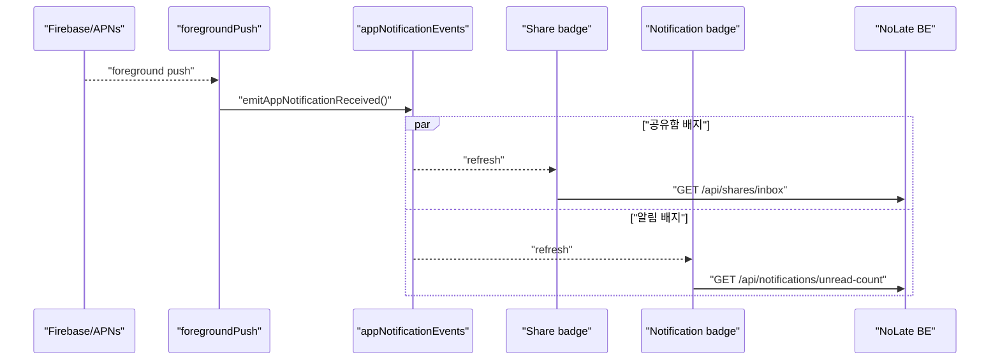
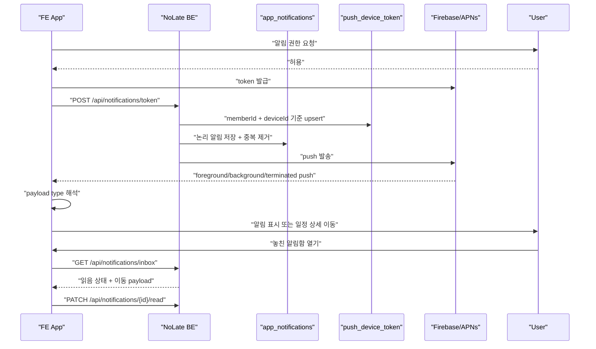

# Notification / FCM / App Push Roadmap

Last verified: 2026-07-24 KST

이 문서는 FCM/APNs 토큰 등록, push 발송, FE 수신/표시/이동 처리의 상태를 관리한다. 일정 ETA 정책은 [`../schedule/PUSH_NOTIFICATION_STATUS.md`](../schedule/PUSH_NOTIFICATION_STATUS.md)를 기준으로 한다.

상위 로드맵:

- [`../roadmap.md`](../roadmap.md)

## Current Status

BE 완료:

- `/api/notifications/token` 토큰 등록
- member/device 기준 token upsert
- 다른 회원에 묶인 token/device 정리
- 회원별 토큰 조회 후 PushClient 발송
- Firebase PushClient와 Dummy PushClient
- Android high priority push, default sound, `schedule-push` channel
- Firebase APNs alert payload
- `departNow=true` 일정 알림의 iOS `schedule_depart_now` category
- invalid token과 `BadEnvironmentKeyInToken` 삭제 처리
- `/api/notifications/test/send`
- `PushScenarioRunner`
- `push_send_history` 발송 이력 저장
- `GET /api/notifications/send-histories`
- `app_notifications` 사용자 알림함 영속 저장과 회원별 읽음 상태 관리
- FCM token 부재·만료·발송 실패와 무관하게 push 호출 전에 앱 알림 저장
- `(member_id, deduplication_key)` 유니크 제약과 독립 트랜잭션으로 worker 재시도·동시 이벤트 중복 방지
- 최신순 cursor pagination, 읽지 않음 필터, 미확인 개수 조회
- `GET /api/notifications/inbox`, `GET /api/notifications/unread-count`
- `PATCH /api/notifications/{notificationId}/read`, `PATCH /api/notifications/read-all`
- 공유 참가자의 첫 `depart-now` 커밋 후 오너·직접 공유·카테고리 공유 대상에게 자동 push
- 자동 출발 알림의 중복 수신자/출발 당사자 제외와 동시 요청 1회 발행 보장
- `AFTER_COMMIT + REQUIRES_NEW` 경계로 자동 push 결과 이력의 독립 커밋 보장
- 오너 전용 `POST /api/schedules/{scheduleId}/departure-nudges/{targetMemberId}` 지정 알림
- 활성 공유 대상, 미출발 상태를 서버에서 재검증한 뒤 지정 알림 발송

FE 완료:

- 로그인 후 FCM token 등록
- deviceId 생성 및 SecureStore 저장
- token refresh 시 BE 재등록
- Android 13+ notification permission 요청
- foreground push를 local notification으로 표시
- payload에서 `scheduleId` 추출
- `SCHEDULE_TRAFFIC`, `SCHEDULE_DEPARTURE_REMINDER`, `SCHEDULE_DETAIL` 상세 이동 규칙
- 알림 클릭 시 `/schedule/[id]` route 생성
- `departNow=true` 알림의 출발 완료 액션 연결
- 출발 완료 액션에서 `POST /api/schedules/{scheduleId}/depart-now` 호출
- TestFlight build에서 production APS entitlement 확인
- `SCHEDULE_PARTICIPANT_DEPARTED`, `SCHEDULE_DEPARTURE_NUDGE` 일정 상세 이동 규칙
- 오너 상세 화면에서 대기 중 공유 참가자별 출발 확인 알림 버튼 제공
- 수신자/이미 출발한 참가자에게 지정 알림 버튼을 숨기고 발송 결과를 화면에 구분 표시
- 메인 캘린더 알림함 버튼과 읽지 않은 알림 배지
- 전체/읽지 않음 필터, cursor pagination, pull-to-refresh, 모두 읽음이 포함된 앱 알림함 화면
- 실시간 push와 앱 알림함이 같은 payload 해석 및 일정 상세/공유함 이동 규칙 사용
- 알림 선택 시 읽음 처리 후 대상 화면 이동, 포그라운드 수신·앱 복귀 시 배지 갱신
- 메인 캘린더 공유함·알림 배지의 45초 polling 제거
- 화면 최초 진입, 포그라운드 push 수신, 앱 active 복귀를 기준으로 공유함·알림 배지 갱신
- 하나의 `emitAppNotificationReceived` 이벤트를 공유함 attention과 영속 알림 unread-count 구독자에게 fan-out

## 2026-07-24 Push-driven Badge Refresh

### 변경 전

메인 일정 화면이 focus 상태이면 다음 두 조회가 각각 45초마다 반복됐다.

- 공유함 배지: `GET /api/shares/inbox`
- 알림 배지: `GET /api/notifications/unread-count`

따라서 일정 화면을 계속 열어 둔 사용자 한 명당 최대 45초마다 BE 조회 2회, 시간당 약 160회의 주기 요청이 발생했다. push가 이미 새 이벤트 도착 사실을 전달하고 있어도 배지 반영은 polling 시점에 따라 최대 45초 늦을 수 있었다.

### 변경 후

45초 timer를 모두 제거하고 다음 세 시점에만 조회한다.

1. 일정 화면이 focus될 때 최초 1회
2. 앱이 foreground에서 FCM push를 수신해 `emitAppNotificationReceived()`를 발생시킬 때
3. background 또는 suspended 상태에서 push 시점의 JS 실행을 보장할 수 없으므로 앱이 다시 `active`가 될 때

포그라운드 push 처리 순서:

구독은 일정 화면이 focus 상태인 동안만 유지하고 cleanup에서 모두 해제한다. 공유함 조회는 화면이 unmount된 뒤 완료된 응답이 state를 변경하지 않도록 기존 cancellation guard를 유지한다.

### 운영 영향

- 공유함·알림 배지의 유휴 polling 트래픽을 제거한다.
- push 도착 직후 조회하므로 정상 전달 상황에서는 배지 지연을 줄인다.
- background push는 앱 프로세스가 정지될 수 있으므로 foreground 복귀 동기화를 안전장치로 유지한다.
- push 전달이 실패한 상태에서 사용자가 앱을 계속 foreground로 유지하면 주기 fallback이 없으므로, 다음 화면 focus 또는 앱 active 복귀 전까지 배지가 늦게 갱신될 수 있다. 영속 알림 row 자체는 BE에 남는다.
- `RouteStepTimeline`의 실시간 대중교통 도착정보 45초 갱신은 이번 변경 범위가 아니다. 이 요청은 FE에서 NoLate BE의 `/api/transit-arrivals/*` 프록시를 거치므로 별도의 focus/AppState 제어와 짧은 TTL cache 최적화 대상으로 관리한다.

### Acceptance

1. TestFlight foreground 상태에서 일정 공유 push를 받으면 공유함 배지와 알림 배지가 추가 polling 대기 없이 갱신된다.
2. 일정 화면을 90초 이상 유휴 상태로 두어도 공유함·알림 unread API가 45초 간격으로 반복 호출되지 않는다.
3. push 한 건당 공유함·알림 배지 조회가 각각 한 번만 발생하고 화면 재진입 후 중복 listener가 남지 않는다.
4. background에서 push를 받은 뒤 앱을 직접 열거나 알림을 누르면 active 복귀 조회로 최신 배지가 복구된다.
5. push token 만료 또는 전달 실패 시 앱 재실행·화면 재진입으로 BE의 영속 알림이 복구되는지 확인한다.

## Tests

BE:

- `src/test/kotlin/com/noLate/notification/application/service/NotificationServiceUnitTest.kt`
- `src/test/kotlin/com/noLate/notification/application/service/NotificationTokenServiceIntegrationTest.kt`
- `src/test/kotlin/com/noLate/notification/application/useCase/NotificationUseCaseUnitTest.kt`
- `src/test/kotlin/com/noLate/notification/dev/PushScenarioRunnerTest.kt`
- `src/test/kotlin/com/noLate/notification/application/service/PushSendHistoryServiceTest.kt`
- `src/test/kotlin/com/noLate/notification/domain/AppNotificationTest.kt`
- `src/test/kotlin/com/noLate/notification/application/service/AppNotificationServiceIntegrationTest.kt`
- `src/test/kotlin/com/noLate/notification/controller/AppNotificationControllerUnitTest.kt`
- `src/test/kotlin/com/noLate/schedule/application/service/ScheduleDepartureStatusConcurrencyIntegrationTest.kt`
- `src/test/kotlin/com/noLate/schedule/application/service/ScheduleDeparturePushNotificationListenerUnitTest.kt`
- `src/test/kotlin/com/noLate/schedule/application/service/ScheduleDepartureNotificationServiceUnitTest.kt`
- `src/test/kotlin/com/noLate/schedule/controller/ScheduleDepartureNotificationControllerUnitTest.kt`

FE:

- `NoLate_FE/__tests__/App.test.tsx`
- `NoLate_FE/__tests__/apiWrappers.test.ts`
- `NoLate_FE/__tests__/appNotificationApi.test.ts`
- `NoLate_FE/__tests__/appNotificationPresentation.test.ts`
- `NoLate_FE/__tests__/appNotificationEvents.test.ts`
- `NoLate_FE/__tests__/scheduleDepartureNudgePresentation.test.ts`

## Remaining Acceptance

1. iPhone TestFlight 최신 빌드에서 실제 push token 재등록 확인
2. iPhone 실기기에서 실제 일정 push 3종 수신
3. background 상태 알림 클릭 시 일정 상세 이동
4. terminated 상태 알림 클릭 시 일정 상세 이동
5. `departNow=true` 출발 완료 액션 후 운영 BE `depart-now` API 성공
6. 출발 완료 액션 후 PushJob 취소와 일정 알림 OFF 확인
7. 같은 기기에서 계정 전환 시 이전 계정으로 push가 가지 않는지 확인
8. 실제 Firebase E2E 테스트 절차 문서화
9. invalid token 삭제 지표와 로그 모니터링
10. 참가자 첫 출발 자동 push를 오너와 다른 공유 참가자 실기기에서 수신하고 상세 이동 확인
11. 오너 지정 출발 확인 push를 선택한 참가자 한 명에게만 수신하고 상세 이동 확인
12. TestFlight에서 push를 받지 못한 경우에도 앱 재실행 후 알림함에 동일 이벤트가 남는지 확인
13. 다중 기기 로그인에서 한 기기가 읽은 알림 상태와 배지가 다른 기기에 반영되는지 확인
14. 알림 보관 기간·삭제 정책과 운영 데이터 증가량 모니터링 기준 확정
15. foreground 공유 push 직후 공유함·알림 배지가 즉시 갱신되는지 확인
16. 90초 이상 유휴 상태에서 두 배지 API의 45초 polling이 사라졌는지 네트워크 로그로 확인

로컬 검증 메모:

- iOS Simulator 빌드는 APNs token 등록을 의도적으로 건너뛰므로 `simctl push` payload 저장과 FE 라우팅까지만 검증한다.
- 실제 원격 전달 성공 여부는 `FIREBASE_ENABLED=true`와 유효한 실기기 token이 있는 환경에서 확인한다.
- 로컬에서 만료된 FCM token의 발송 실패·token 삭제 이후에도 공유 알림 row가 남는 것을 확인했다.
- iOS 시뮬레이터에서는 알림함 목록, 읽음 처리, 배지, 일정 상세 이동을 실제 API 데이터로 검증한다.
- 2026-07-22 수신자 시뮬레이터에서 `미확인 배지 1 -> 새 일정 공유 -> 공유 일정 상세 -> 배지 0` 흐름을 실제 계정·API 데이터로 통과했다.
- 2026-07-24 push 이벤트 fan-out 단위 테스트, FE typecheck, ESLint를 통과했다.
- FE 전체 Jest 결과는 134 suites, 898 tests이다.

## Main Files

Backend:

- `src/main/kotlin/com/noLate/notification/controller/NotificationController.kt`
- `src/main/kotlin/com/noLate/notification/application/useCase/NotificationUseCase.kt`
- `src/main/kotlin/com/noLate/notification/application/service/NotificationTokenService.kt`
- `src/main/kotlin/com/noLate/notification/application/service/PushSendHistoryService.kt`
- `src/main/kotlin/com/noLate/notification/domain/AppNotification.kt`
- `src/main/kotlin/com/noLate/notification/application/service/AppNotificationService.kt`
- `src/main/kotlin/com/noLate/notification/controller/AppNotificationController.kt`
- `src/main/kotlin/com/noLate/notification/infrastructure/FirebasePushConfiguration.kt`
- `src/main/kotlin/com/noLate/notification/infrastructure/PushClientApplication.kt`
- `src/main/kotlin/com/noLate/notification/dev/PushScenarioRunner.kt`
- `src/main/kotlin/com/noLate/notification/dev/PushScenarioController.kt`
- `src/main/kotlin/com/noLate/schedule/application/service/ScheduleDeparturePushNotificationListener.kt`
- `src/main/kotlin/com/noLate/schedule/application/service/ScheduleDepartureNotificationService.kt`
- `src/main/kotlin/com/noLate/schedule/controller/ScheduleDepartureNotificationController.kt`

Frontend:

- `NoLate_FE/src/api/notification.ts`
- `NoLate_FE/src/modules/notification/pushRegistration.ts`
- `NoLate_FE/src/modules/notification/foregroundPush.ts`
- `NoLate_FE/src/modules/notification/pushNavigation.ts`
- `NoLate_FE/src/modules/notification/appNotificationPresentation.ts`
- `NoLate_FE/src/modules/notification/appNotificationEvents.ts`
- `NoLate_FE/app/notifications.tsx`
- `NoLate_FE/app/schedule/index.tsx`
- `NoLate_FE/app/schedule/[id].tsx`
- `NoLate_FE/src/modules/schedule/detailPresentation.ts`

## Roadmap

## Next Slice

1. TestFlight foreground 공유 push에서 공유함·알림 배지 즉시 갱신 확인
2. 90초 유휴 네트워크 로그에서 두 배지 API의 polling 제거 확인
3. TestFlight 최신 빌드에서 token 재등록과 알림함 API 연동 확인
4. 실제 일정 기반 Runner로 iPhone push 3종 수신 확인
5. push 실패·앱 종료 상황에서 알림함 복구와 상세 이동 확인
6. background/terminated 알림 클릭 상세 이동 확인
7. `departNow=true` 액션과 PushJob 취소 확인
8. 결과를 [`../quality/mvp-acceptance-checklist.md`](../quality/mvp-acceptance-checklist.md)에 기록
