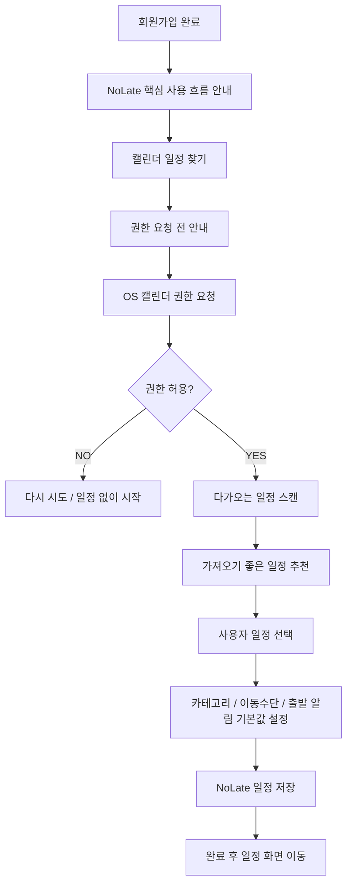

# Calendar Curation Onboarding Roadmap

Last verified: 2026-07-05 KST

가입 직후 사용자가 NoLate의 핵심 흐름을 끊김 없이 경험하도록 만드는 캘린더 큐레이션 로드맵이다.

## Goal

- 일반 회원가입과 SNS 신규 가입 직후 캘린더 큐레이션으로 자연스럽게 진입한다.
- iOS에서는 Apple Calendar, iCloud Calendar, iOS 기기 캘린더에 연결된 Google/Outlook 일정을 후보로 보여준다.
- Android에서는 기기 캘린더 provider에 노출된 Google/Samsung/기타 일정을 후보로 보여준다.
- 사용자가 선택한 외부 일정을 NoLate `Schedule`로 가져온다.
- 가져온 일정은 NoLate 안에서 장소, 이동수단, 출발 알림을 보강할 수 있다.
- 외부 캘린더는 MVP에서 수정하지 않는다.

## Product Flow

토스처럼 흐름이 끊기지 않게 한 화면에 하나의 결정을 둔다.

<!-- mermaidId: calendar-curation-onboarding-flow -->

## UX Principles

- 설명은 긴 튜토리얼이 아니라 행동 직전의 짧은 이유로 제공한다.
- OS 권한 팝업은 앱 내부 설명 이후에 띄운다.
- `다음` 대신 `일정 불러오기`, `선택한 일정 가져오기`, `내 일정 보기`처럼 행동형 CTA를 사용한다.
- `나중에 할게요`는 항상 제공하되 시각적 우선순위는 낮춘다.
- 일정 후보는 전체 dump가 아니라 "가져오면 좋은 일정"처럼 추천 결과로 보여준다.

## MVP Scope

### Included

- FE `expo-calendar` 기반 device calendar read
- iOS Apple Calendar full access 안내와 권한 요청
- Android device calendar read 권한 요청
- 오늘 기준 `-7일 ~ +90일` 일정 후보 조회
- 시간 있는 일정 import
- 종일 일정은 후보로 보여주되 MVP에서는 시간 지정 필요 상태로 처리
- 기존 `POST /api/schedules` API 재사용
- SNS 신규 가입 여부를 알려주는 `MemberDto.isNewMember` 응답 필드

### Excluded

- Google Calendar 서버 OAuth 직접 연동
- Microsoft Graph 직접 연동
- iCloud CalDAV 서버 연동
- 외부 캘린더 변경사항 동기화
- 외부 캘린더로 NoLate 변경사항 write-back
- 외부 event link 테이블 기반 영구 중복 방지

## Implementation Slices

### Slice 1: Device Calendar Import

1. `expo-calendar` 설치
2. iOS/Android 권한 문구 설정
3. device calendar 후보 조회 모듈 추가
4. 외부 event -> NoLate schedule payload 변환
5. `/onboarding/calendar-import` 화면 추가
6. 일반 회원가입 후 온보딩으로 이동
7. SNS 신규 가입 후 온보딩으로 이동

### Slice 2: Persistent Onboarding State

1. `MemberSetting` 또는 별도 `MemberOnboarding`에 완료 상태 저장
2. `onboardingCompletedAt`
3. `calendarImportSkippedAt`
4. `initialCalendarImportCompletedAt`
5. 로그인 응답에 `onboardingRequired` 추가

### Slice 3: Durable External Link

1. `CalendarProvider` enum 추가
2. `ExternalCalendarEventLink` 모델 추가
3. `memberId + provider + calendarId + eventId` unique key 추가
4. `POST /api/external-calendars/events/import` 추가
5. 중복 import 차단

### Slice 4: Direct Provider Sync

1. Google Calendar OAuth read-only 연결
2. Microsoft Graph calendar read 연결
3. provider별 token refresh/reconnect 상태 표시
4. one-way sync와 변경 후보 검토 UI 추가

## Mapping Rules

- 외부 event `title` -> NoLate `title`
- 외부 event `startDate` -> NoLate `startAt`
- 외부 event `endDate` -> NoLate `endAt`
- 외부 event `location` -> NoLate `locationName`, `destination.name`
- 외부 event `notes` -> NoLate `notes`
- all-day event -> MVP에서는 import 기본 선택 제외
- 기본 category -> 사용자의 첫 번째 schedule category
- 기본 이동수단 -> `TRANSIT`
- 기본 이동시간 -> 30분
- 기본 출발 알림 -> 미래 일정이면 ON

## Verification

- iOS 실기기에서 Apple Calendar 권한 요청이 표시된다.
- 권한 허용 후 iCloud/Apple Calendar 일정 후보가 표시된다.
- Android 실기기에서 calendar read 권한 요청이 표시된다.
- 일정 후보 중 시간 있는 일정만 기본 선택된다.
- 선택한 일정이 `POST /api/schedules`로 저장된다.
- 가져온 일정이 캘린더 화면에 표시된다.
- SNS 기존 회원 로그인은 온보딩으로 가지 않는다.
- SNS 신규 가입은 온보딩으로 간다.
