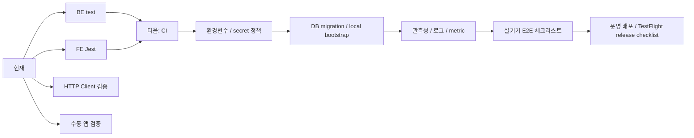

# Quality / Ops / Developer Tools Roadmap

Last verified: 2026-06-25 KST

테스트, CI, 환경변수, 로컬 실행, 관측성, 개발 검증 도구의 상세 로드맵이다.

상위 로드맵:

- [`../roadmap.md`](../roadmap.md)

## Current Status

### BE 완료

- Gradle test 통과 확인
- schedule/member/notification/subscription 단위 테스트와 일부 통합 테스트
- 외부 API 테스트는 `external` tag로 분리된 구조
- HTTP Client 파일
  - `http/schedule-parser.http`
  - `http/push-scenario-runner.http`

### FE 완료

- Jest 테스트 일부
- TypeScript compile 확인 가능
- Xcode archive/export로 TestFlight IPA 생성 확인
- App Store Connect API key 기반 `altool` 업로드 경로 확인

### 개발 검증 문서

- [`../schedule/schedule-push-codex-handoff.md`](../schedule/schedule-push-codex-handoff.md)
- [`../schedule/push-scenario-runner.md`](../schedule/push-scenario-runner.md)
- [`../roadmap.md`](../roadmap.md)
- [`../member/member-auth-profile-roadmap.md`](../member/member-auth-profile-roadmap.md)
- [`../notification/notification-fcm-app-push-roadmap.md`](../notification/notification-fcm-app-push-roadmap.md)
- [`../subscription/subscription-policy-roadmap.md`](../subscription/subscription-policy-roadmap.md)
- [`../frontend/fe-app-route-ux-roadmap.md`](../frontend/fe-app-route-ux-roadmap.md)
- [`../integrations/external-calendar-integration-roadmap.md`](../integrations/external-calendar-integration-roadmap.md)
- [`quality-ops-developer-tools-roadmap.md`](quality-ops-developer-tools-roadmap.md)

## Next Work

- CI pipeline
  - BE `gradlew test`
  - FE `npm test -- --runInBand`
  - FE `npx tsc --noEmit`
- DB migration 도구 도입 또는 정리
- 환경변수 문서화
  - Firebase
  - Tmap
  - Kakao/Naver map
  - Groq
  - DB
  - Google Calendar
- secret commit 방지
- 로컬 실행 스크립트 정리
- 로그 인코딩 정리
- observability
  - push success/failure metric
  - ETA API latency
  - scheduler job count
  - invalid token count
  - external calendar sync status
- Docker compose 또는 devcontainer 정리
- 앱 실기기 E2E 체크리스트
- 운영 BE 배포 절차 문서화
- TestFlight 업로드 전 빌드 번호 증가 자동화

## Roadmap

<!-- mermaidId: quality-ops-roadmap -->



## Verification Commands

BE:

```powershell
cd D:\DevSpace\application\no-late\NoLate_BE
.\gradlew.bat --no-daemon test
```

FE:

```powershell
cd D:\DevSpace\application\no-late\NoLate_FE
npm test -- --runInBand
npx tsc --noEmit
```

PushScenarioRunner manual API:

```powershell
cd D:\DevSpace\application\no-late\NoLate_BE
# Open http/push-scenario-runner.http in JetBrains HTTP Client.
```

## Suggested First Slice

1. GitHub Actions 또는 기존 CI 환경 확인
2. BE test job 추가
3. FE test/typecheck job 추가
4. 환경변수 샘플 문서 추가
5. secret scan 정책 추가
6. 실기기 E2E 체크리스트 문서화
7. 운영 BE deploy 절차와 TestFlight build-number bump 절차 문서화
