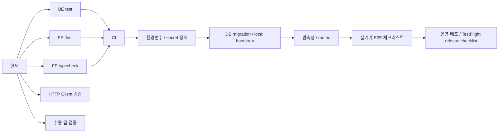

# Quality / Ops / Developer Tools Roadmap

Last verified: 2026-07-24 KST

테스트, CI, 환경변수, 로컬 실행, 관측성, 개발 검증 도구의 상세 로드맵이다.

상위 로드맵:

- [`../roadmap.md`](../roadmap.md)

## Current Status

완료:

- BE Gradle test 통과 확인
- schedule/member/notification/subscription 단위 테스트와 일부 통합 테스트
- 외부 API 테스트는 `external` tag로 분리된 구조
- FE Jest 테스트 일부
- FE TypeScript compile 확인 가능
- Xcode archive/export로 TestFlight IPA 생성 확인
- App Store Connect API key 기반 `altool` 업로드 경로 확인
- Redis 기반 캘린더 조회 캐시
  - 사용자·revision·월 단위 일정 캐시, 기본 TTL 15분
  - 전 사용자 공용 음력/공휴일 월 캐시, 기본 TTL 24시간
  - Redis read/write 장애 시 기존 DB 조회 결과를 반환하는 fallback
  - 손상되거나 불완전한 메타데이터 월은 해당 월만 다시 적재
  - 같은 인스턴스의 동시 cold miss는 월별 striped lock으로 중복 적재 방지
- 일정/공유 변경 트랜잭션 커밋 이후 영향 회원 cache revision 무효화
- HTTP Client 검증 파일
  - `http/schedule-parser.http`
  - `http/push-scenario-runner.http`

운영 전 핵심 체크리스트:

- [`mvp-acceptance-checklist.md`](mvp-acceptance-checklist.md)

## Verification Commands

BE:

```powershell
cd D:\DevSpace\application\no-late\NoLate_BE
.\gradlew.bat --no-daemon test
```

FE:

```powershell
cd D:\DevSpace\application\no-late\NoLate_FE
npm test -- --runInBand
npx tsc --noEmit
```

PushScenarioRunner manual API:

```powershell
cd D:\DevSpace\application\no-late\NoLate_BE
# Open http/push-scenario-runner.http in JetBrains HTTP Client.
```

## 2026-07-24 Calendar Cache Verification

- BE 전체 Gradle test 413개 실행: 실패 0개, 환경 조건부 3개 skip
- FE calendar metadata API/범위 계약 6개 테스트와 TypeScript typecheck 통과
- 실제 Redis에서 FE 최대 프리패치 범위 98일을 요청해 `MISS -> STORE -> HIT` 확인
  - cold: 5개 월을 2개 연속 범위로 묶어 메타데이터 SQL 4건, 0.550초
  - warm: Redis `multiGet` HIT, 회원/`calendar_day_cache`/`public_holidays` SQL 0건, 0.032초
  - 한 달 이동: 새로 노출된 10월만 SQL 2건 후 저장, 재조회 SQL 0건, 0.0056초
- 월별 Redis 값의 전체 날짜 수와 약 86,400초 TTL 확인
- cold 측정은 외부 KASI 네트워크 시간을 분리하기 위해 KASI 연동을 비활성화하고 Redis/DB 경로만 측정

## Next Work

CI:

- BE `gradlew test`
- FE `npm test -- --runInBand`
- FE `npx tsc --noEmit`

환경과 운영:

- Firebase, Tmap, Kakao/Naver map, Groq, DB 환경변수 문서화
- secret commit 방지
- 로컬 실행 스크립트 정리
- 운영 BE deploy 절차 문서화
- TestFlight build number 증가 자동화
- DB migration 도구 도입 또는 정리
- 다중 BE 인스턴스에서 같은 월 cold miss를 합치는 Redis 분산 single-flight 검토
- 공개 메타데이터 endpoint의 rate limit 또는 지원 연도 범위 정책

관측성:

- push success/failure metric
- ETA API latency
- scheduler due job count
- invalid token count
- PushJob status count
- external calendar sync status
- 일정/메타데이터 캐시 hit, miss, fallback, invalidation count와 p95 latency

실기기 E2E:

- TestFlight 최신 빌드 token 재등록
- 실제 일정 push 3종 수신
- 알림 터치 상세 이동
- 출발 완료 액션 후 PushJob 취소
- 같은 기기 계정 전환 token ownership 확인

## Roadmap



## Suggested First Slice

1. [`mvp-acceptance-checklist.md`](mvp-acceptance-checklist.md)를 기준으로 남은 push acceptance 실행
2. BE test CI job 추가
3. FE test/typecheck CI job 추가
4. 운영 BE deploy 절차 문서화
5. Firebase/Tmap 환경변수 샘플 문서 추가
6. push 관측성 지표 초안 추가
