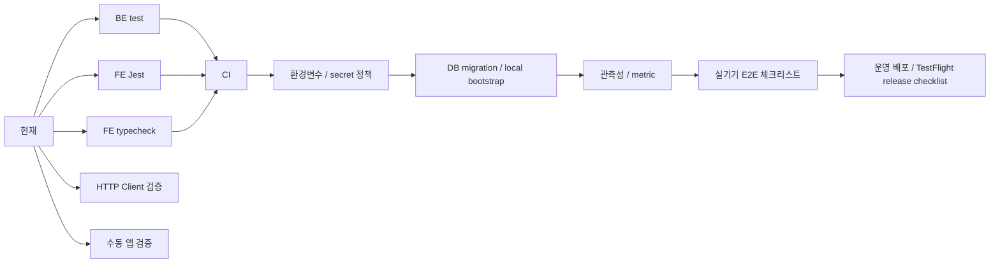

# Quality / Ops / Developer Tools Roadmap

Last verified: 2026-06-26 KST

테스트, CI, 환경변수, 로컬 실행, 관측성, 개발 검증 도구의 상세 로드맵이다.

상위 로드맵:

- [`../roadmap.md`](../roadmap.md)

## Current Status

완료:

- BE Gradle test 통과 확인
- schedule/member/notification/subscription 단위 테스트와 일부 통합 테스트
- 외부 API 테스트는 `external` tag로 분리된 구조
- FE Jest 테스트 일부
- FE TypeScript compile 확인 가능
- Xcode archive/export로 TestFlight IPA 생성 확인
- App Store Connect API key 기반 `altool` 업로드 경로 확인
- HTTP Client 검증 파일
  - `http/schedule-parser.http`
  - `http/push-scenario-runner.http`

운영 전 핵심 체크리스트:

- [`mvp-acceptance-checklist.md`](mvp-acceptance-checklist.md)

## Verification Commands

BE:

```powershell
cd D:\DevSpace\application\no-late\NoLate_BE
.\gradlew.bat --no-daemon test
```

FE:

```powershell
cd D:\DevSpace\application\no-late\NoLate_FE
npm test -- --runInBand
npx tsc --noEmit
```

PushScenarioRunner manual API:

```powershell
cd D:\DevSpace\application\no-late\NoLate_BE
# Open http/push-scenario-runner.http in JetBrains HTTP Client.
```

## Next Work

CI:

- BE `gradlew test`
- FE `npm test -- --runInBand`
- FE `npx tsc --noEmit`

환경과 운영:

- Firebase, Tmap, Kakao/Naver map, Groq, DB 환경변수 문서화
- secret commit 방지
- 로컬 실행 스크립트 정리
- 운영 BE deploy 절차 문서화
- TestFlight build number 증가 자동화
- DB migration 도구 도입 또는 정리

관측성:

- push success/failure metric
- ETA API latency
- scheduler due job count
- invalid token count
- PushJob status count
- external calendar sync status

실기기 E2E:

- TestFlight 최신 빌드 token 재등록
- 실제 일정 push 3종 수신
- 알림 터치 상세 이동
- 출발 완료 액션 후 PushJob 취소
- 같은 기기 계정 전환 token ownership 확인

## Roadmap



## Suggested First Slice

1. [`mvp-acceptance-checklist.md`](mvp-acceptance-checklist.md)를 기준으로 남은 push acceptance 실행
2. BE test CI job 추가
3. FE test/typecheck CI job 추가
4. 운영 BE deploy 절차 문서화
5. Firebase/Tmap 환경변수 샘플 문서 추가
6. push 관측성 지표 초안 추가
