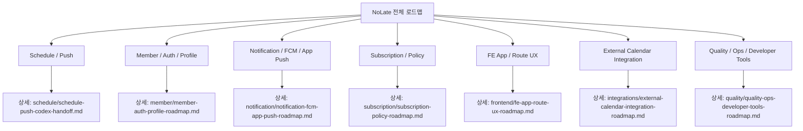

# NoLate BE Roadmap

Last verified: 2026-06-26 KST

이 문서는 NoLate BE 문서의 상위 인덱스다. 각 도메인의 구체적인 설계, 완료 범위, 다음 작업, 테스트 후보는 분야별 디렉터리의 개별 md 파일에서 관리한다.

## Roadmap Index

| Area | Detail Document | Current Status | Next Focus |
| --- | --- | --- | --- |
| Schedule / Push | [`schedule/schedule-push-codex-handoff.md`](schedule/schedule-push-codex-handoff.md) | 4단계 완료, 5단계 진행 중 | iOS 실기기 3종 push acceptance, 운영 BE 배포 검증, 중복 발송 방지 |
| Member / Auth / Profile | [`member/member-auth-profile-roadmap.md`](member/member-auth-profile-roadmap.md) | 회원가입, 로그인, refresh, 프로필, 비밀번호, 탈퇴 완료 | 이메일 인증, 비밀번호 재설정, SNS 토큰 검증 |
| Notification / FCM / App Push | [`notification/notification-fcm-app-push-roadmap.md`](notification/notification-fcm-app-push-roadmap.md) | payload 라우팅, 상세 이동 규칙, `depart-now` API/action 완료 | iOS 실기기 알림 액션 acceptance, 권한/토큰 복구 UX |
| Subscription / Policy | [`subscription/subscription-policy-roadmap.md`](subscription/subscription-policy-roadmap.md) | FREE/PREMIUM 정책 모델, 내 정책 조회, 일정 정책 검증 완료 | 결제/구독 모델, plan 변경, paywall |
| FE App / Route UX | [`frontend/fe-app-route-ux-roadmap.md`](frontend/fe-app-route-ux-roadmap.md) | 로그인, 일정/경로, 프로필, 알림 이동/액션 기반 완료 | 실기기 UX 검증, 권한/빈/오류 상태 정리 |
| External Calendar Integration | [`integrations/external-calendar-integration-roadmap.md`](integrations/external-calendar-integration-roadmap.md) | 로드맵 단계 정의 | Google/Apple import MVP 설계 |
| Quality / Ops / Developer Tools | [`quality/quality-ops-developer-tools-roadmap.md`](quality/quality-ops-developer-tools-roadmap.md) | BE/FE 테스트 일부, HTTP Client 검증, TestFlight 업로드 경로 확인 | CI, 환경변수 문서, 관측성, E2E 체크리스트 |

## Supporting Docs

| Area | Document | Purpose |
| --- | --- | --- |
| Schedule / Push | [`schedule/PUSH_NOTIFICATION_STATUS.md`](schedule/PUSH_NOTIFICATION_STATUS.md) | 일정 푸시 알림의 제품 규칙, 주요 코드, 검증 상태 |
| Schedule / Push | [`schedule/push-scenario-runner.md`](schedule/push-scenario-runner.md) | PushScenarioRunner 사용법과 수동 검증 흐름 |

## Current Phase Summary

전체 진행은 **4단계 완료, 5단계 진행 중**이다.

1. PushJob 생성/취소 안정화: 완료
2. ETA fallback/복구/재시도 안정화: 완료
3. 실제 FCM 발송과 발송 이력 관리: 완료
4. FE payload 라우팅, 상세 이동 규칙, `depart-now`/출발 완료 액션: 완료
5. 실기기 E2E와 운영 안정화: 진행 중

2026-06-26 기준 BE 작업 브랜치에는 `origin/main` 최신 변경을 반영했다. 현재 push 기능은 코드 구현과 단위/통합 테스트 기준으로 4단계까지 완료되어 있으며, 5단계는 TestFlight 실기기 acceptance와 운영 배포 검증이 남아 있다.

## Roadmap Overview

<!-- mermaidId: no-late-roadmap-overview -->



## Suggested Work Order

1. iPhone TestFlight 최신 빌드에서 실제 일정 푸시 3종 수신과 알림 터치 상세 이동 검증
2. `departNow=true` 알림 액션에서 `POST /api/schedules/{scheduleId}/depart-now`가 운영 BE까지 성공하는지 검증
3. 운영 BE에 `depart-now` API와 최신 푸시 문구 배포 확인
4. routeJson FE/BE 계약 문서화
5. 발송 이벤트 단위 중복 방지(outbox 또는 idempotency key) 설계
6. 일정 상세/푸시 맥락의 날씨 정보 UX 설계
   - 우선순위는 push 실기기 acceptance 이후
   - 1차 범위는 도착지 기준 현재 날씨와 일정 시작 시간대 예보
7. External Calendar Integration 1단계 설계
   - Google Calendar import
   - Apple Calendar 또는 기기 캘린더 import
   - 외부 event와 NoLate Schedule 매핑
8. Member/Auth 보안 보강
   - 비밀번호 재설정
   - 이메일 인증
   - 로그인 rate limit
9. Subscription plan 변경과 paywall 설계
10. CI와 환경변수 문서화
11. 실제 Firebase/Tmap/Groq/Google Calendar 외부 연동 테스트 분리 실행

## Verification Commands

자세한 테스트/운영 검증 명령은 [`quality/quality-ops-developer-tools-roadmap.md`](quality/quality-ops-developer-tools-roadmap.md)에서 관리한다.

BE:

```powershell
cd D:\DevSpace\application\no-late\NoLate_BE
.\gradlew.bat --no-daemon test
```

FE:

```powershell
cd D:\DevSpace\application\no-late\NoLate_FE
npm test -- --runInBand
npx tsc --noEmit
```
