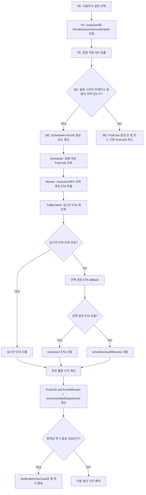
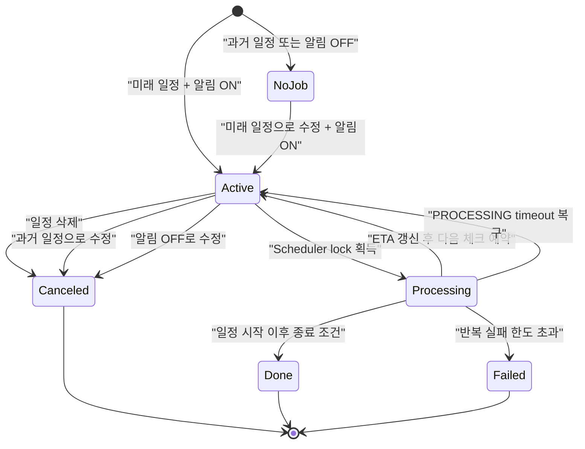
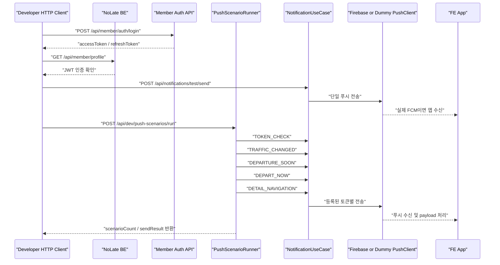
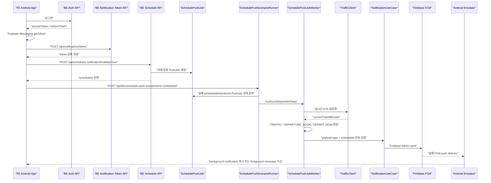
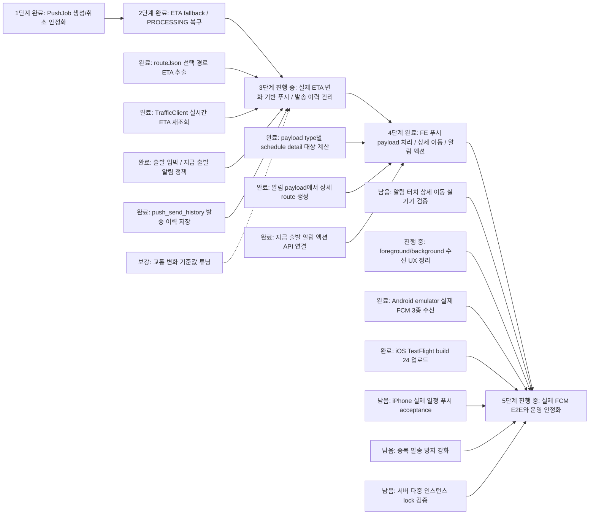

# Schedule / Push Codex Handoff

Last verified: 2026-06-25 KST

이 문서는 다른 작업 공간에서 Codex로 이어서 작업할 때 필요한 일정 관리, ETA 재조회, PushJob, 앱 푸시 검증 맥락을 정리한 인수인계 문서다.

## Repository Layout

- BE: `D:\DevSpace\application\no-late\NoLate_BE`
- FE: `D:\DevSpace\application\no-late\NoLate_FE`
- BE docs: `NoLate_BE/docs`
- BE HTTP client files: `NoLate_BE/http`

## Current Status

### BE 완료

- 일정 등록, 수정, 삭제 API와 PushJob 연동
- 과거 일정 등록/수정 허용
- 과거 일정 또는 알림 비활성 일정은 PushJob 미생성
- 미래 일정이고 알림이 켜져 있으면 PushJob 생성/갱신
- 일정 수정 시 PushJob 재등록 또는 취소
- 일정 삭제 시 관련 PushJob 취소
- 일정 저장/수정과 PushJob 변경은 `ScheduleUseCase`에서 트랜잭션 처리
- `Clock` 주입으로 시간 기준 테스트 가능
- `routeJson`에서 FE가 선택한 경로의 `minutes`, `travelMinutes`, `durationMinutes` 추출
- `TrafficClient`로 실시간 ETA 재조회
- 실시간 ETA 실패 시 선택 경로 ETA, 기존 `travelMinutes` 순서로 fallback
- `PROCESSING` 상태로 남은 PushJob 복구 쿼리 추가
- ETA 변화, 출발 임박, 주기 알림 정책 테스트 추가
- `PushScenarioRunner` 개발/검증용 푸시 시나리오 Runner 추가
- `.http` 파일로 로그인과 PushScenarioRunner 검증 요청 추가
- ETA가 증가한 경우 실제 일정 PushJob에서 `SCHEDULE_TRAFFIC` payload 발송
- 출발 임박 / 지금 출발 알림은 `SCHEDULE_DEPARTURE_REMINDER` payload로 발송
- `SchedulePushScenarioRunner` 개발/검증용 Runner 추가
  - 실제 `scheduleId`와 로그인 회원의 PushJob을 사용
  - 기존 `SchedulePushJobWorker`를 직접 호출
  - 실제 Firebase FCM 전송 경로로 Android 앱 수신 검증 가능
- 3단계 진입: 서버 발송 push 이력 관리 추가
  - Firebase Console은 Admin SDK로 보낸 개별 payload 목록을 보여주지 않으므로 BE에서 직접 관리
  - `push_send_history` 테이블에 성공/실패/무효 토큰/토큰 없음 이력 저장
  - `type`, `scheduleId`, `dataJson`, `fcmMessageId`, 오류 정보를 저장
  - `GET /api/notifications/send-histories`로 로그인 사용자의 최근 발송 이력 조회 가능
- `POST /api/schedules/{scheduleId}/depart-now` 추가
  - 알림의 `지금 출발` 액션을 누르면 일정의 실시간 출발 알림을 끄고 PushJob을 취소한다.
  - 경로/이동 시간 데이터는 유지해 일정 상세와 이후 분석에 사용할 수 있게 한다.
- 최신 BE 코드는 `origin/master`에 push 완료했다.
  - 운영 서버에서 pull/redeploy가 끝나야 TestFlight 앱의 `지금 출발` 액션이 실제 API까지 완전히 동작한다.

### FE 완료

- `src/api/api.ts`
  - 공통 API client와 인증 refresh interceptor 추가
  - access token 만료 시 refresh 후 재시도하는 흐름 보강
- `src/api/member.ts`
  - 로그인, 회원 관련 API wrapper 정리
- `src/api/schedule.ts`
  - 일정 등록/수정/조회 API wrapper 추가
  - 선택 경로 정보가 BE `routeJson`으로 전달될 수 있게 요청 구조 보강
- `src/modules/auth/AuthContext.tsx`
  - 로그인 상태 관리, 토큰 저장/복구, `signOut` 흐름 추가
- `src/modules/schedule/calendarRange.ts`
  - 캘린더 월/주 범위 계산 유틸 추가
- `src/modules/notification/foregroundPush.ts`
  - foreground push 수신 처리 위치 정리
- `app/auth/login.tsx`, `app/auth/signup.tsx`
  - API wrapper와 인증 상태 흐름에 맞춰 로그인/회원가입 화면 연결
- `app/schedule/index.tsx`
  - 일정 화면과 API 연동 흐름 보강
- `app/_layout.tsx`, `src/AppProviders.tsx`
  - 앱 전역 provider 및 인증/알림 초기화 위치 정리
- 로그인 복구 후 FCM token 재등록 bootstrap 추가
  - 앱 재실행, 앱 데이터 초기화, BE token 비활성화 이후에도 `/api/notifications/token` 재등록
- push payload type별 라우팅 정리
  - `SCHEDULE_TRAFFIC`
  - `SCHEDULE_DEPARTURE_REMINDER`
  - `SCHEDULE_DETAIL`
- 4단계 진입: 알림 payload에서 일정 상세 route 생성 규칙 고정
  - `createScheduleDetailRoute(scheduleId)`로 `/schedule/[id]` 이동 객체 생성
  - `getScheduleDetailRouteFromNotificationData(data)`로 payload에서 상세 이동 route 생성
  - Android/iOS/foreground local notification이 같은 route 규칙을 사용
- `SCHEDULE_DEPARTURE_REMINDER` + `departNow=true` payload에 `지금 출발` 알림 액션 연결
  - 알림 액션은 `markScheduleDeparted(scheduleId)`를 호출한다.
  - 일반 알림 터치는 기존처럼 일정 상세 이동 규칙을 따른다.
- Android 설정
  - `android/app/src/main/AndroidManifest.xml`, `app.json`, `android/gradle.properties`에 알림/앱 실행 관련 설정 반영
- iOS 설정
  - Firebase Apple 앱 구성에 APNs 인증 키가 등록됐다.
  - TestFlight용 iOS build 24 업로드 완료.
  - archive에서 `APS_ENVIRONMENT=production`이 적용된 것을 확인했다.
- 테스트
  - `__tests__/apiWrappers.test.ts`
  - `__tests__/calendarRange.test.ts`
  - `__tests__/App.test.tsx`
- 수동 확인
  - Android 앱에서 로그인, 일정 등록 화면 진입, 알림 권한 허용까지 확인
  - 일정 저장 시 선택 경로 정보가 `routeJson`으로 BE에 전달되는 흐름 확인

### 실제 런타임 확인 완료

- 테스트 계정 로그인: `test@test.com / 0000`
- 앱에서 알림 권한 허용
- API로 생성한 일정의 PushJob 생성 확인
- 최신 BE 코드 재기동 후 `routeJson.minutes=45`, `travelMinutes=30` 조건에서 PushJob `lastTravelMinutes=45`로 갱신 확인
- 위 결과로 선택 경로 ETA fallback 흐름은 정상 동작 확인
- Android emulator 실제 FCM 3종 수신 확인
  - 앱 package: `com.anonymous.nolate_fe`
  - 테스트 계정: `570000 / 0000`
  - memberId: `58`
  - 실제 scheduleId: `13`
  - 일정명: `FCM 실제 일정 3종 검증`
  - FE 앱에서 FCM token 발급 후 BE `/api/notifications/token` 등록 확인
  - 실제 일정 등록 후 `SchedulePushScenarioRunner`로 기존 `SchedulePushJobWorker`를 호출
  - Android notification list에서 `com.anonymous.nolate_fe` FCM notification 3건 확인
  - Android notification shade UI dump에서 아래 문구 확인
    - `지금 출발하세요`
    - `FCM 실제 일정 3종 검증 일정에 늦지 않으려면 지금 출발해야 합니다.`
    - `출발 시간 안내`
    - `FCM 실제 일정 3종 검증 일정은 02:21 출발을 권장합니다. 약 15분 후 출발 준비를 해주세요.`
    - `교통시간이 15분 늘었습니다. FCM 실제 일정 3종 검증 일정은 02:21 출발을 권장합니다.`
  - 캡처 파일: `/Users/mac/IdeaProjects/NoLate/output/android/fcm-schedule-push-3types-background-shade.png`
  - UI dump 파일: `/Users/mac/IdeaProjects/NoLate/output/android/fcm-shade-window.xml`
- iOS TestFlight 배포 확인
  - 2026-06-25 기준 build 24 IPA export 및 App Store Connect 업로드 성공
  - Delivery UUID: `0d9b768b-cf18-4869-afad-b7e8f2729603`
  - `altool --build-status` 결과: `VALID`, `APP_STORE_ELIGIBLE`
  - iPhone 실기기에서 일정 푸시 3종 수신, 알림 터치 상세 이동, `지금 출발` 액션은 아직 최종 acceptance 대상이다.

## Main Implementation Files

### BE

- `src/main/kotlin/com/noLate/schedule/application/useCase/ScheduleUseCase.kt`
- `src/main/kotlin/com/noLate/schedule/application/service/SchedulePushJobService.kt`
- `src/main/kotlin/com/noLate/schedule/application/service/SchedulePushJobWorker.kt`
- `src/main/kotlin/com/noLate/schedule/application/TrafficClient.kt`
- `src/main/kotlin/com/noLate/schedule/infrastructure/FallbackTrafficClient.kt`
- `src/main/kotlin/com/noLate/schedule/infrastructure/TmapTrafficClient.kt`
- `src/main/kotlin/com/noLate/schedule/infrastructure/SchedulePushJobRepository.kt`
- `src/main/kotlin/com/noLate/schedule/dev/SchedulePushScenarioRunner.kt`
- `src/main/kotlin/com/noLate/schedule/dev/SchedulePushScenarioController.kt`
- `src/main/kotlin/com/noLate/global/config/TimeConfig.kt`
- `src/main/kotlin/com/noLate/notification/dev/PushScenarioRunner.kt`
- `src/main/kotlin/com/noLate/notification/dev/PushScenarioController.kt`
- `src/main/kotlin/com/noLate/notification/domain/PushSendHistory.kt`
- `src/main/kotlin/com/noLate/notification/application/service/PushSendHistoryService.kt`
- `src/main/kotlin/com/noLate/notification/infrastructure/PushSendHistoryRepository.kt`
- `http/push-scenario-runner.http`
- [`push-scenario-runner.md`](push-scenario-runner.md)

### FE

- `src/api/api.ts`
- `src/api/member.ts`
- `src/api/schedule.ts`
- `src/modules/auth/AuthContext.tsx`
- `src/modules/schedule/calendarRange.ts`
- `src/modules/notification/foregroundPush.ts`
- `src/modules/notification/pushNavigation.ts`
- `src/AppProviders.tsx`
- `app/auth/login.tsx`
- `app/auth/signup.tsx`
- `app/schedule/index.tsx`
- `app/_layout.tsx`
- `__tests__/apiWrappers.test.ts`
- `__tests__/calendarRange.test.ts`

## Mermaid Diagrams

### ETA And PushJob Flow

<!-- mermaidId: schedule-push-eta-flow -->



### Schedule To PushJob Lifecycle

<!-- mermaidId: schedule-pushjob-lifecycle -->



### PushScenarioRunner Flow

<!-- mermaidId: push-scenario-runner-flow -->



### Actual Schedule FCM E2E Flow

<!-- mermaidId: actual-schedule-fcm-e2e-flow -->



### Roadmap Status

<!-- mermaidId: schedule-push-roadmap -->



현재 기준으로 **4단계까지 완료했고 5단계 진행 중**이다. 3단계 BE 핵심 로직, Android emulator 실제 FCM 3종 수신, 서버 발송 이력 저장, FE 상세 이동 규칙, `지금 출발` 액션, TestFlight build 24 업로드까지 끝났다. 다만 iPhone 실기기 일정 푸시 acceptance, 운영 BE 재배포 확인, 교통 변화 기준값 정책 확정, 운영 환경 중복 발송 방지는 다음 단계로 남아 있다.

## PushScenarioRunner

`PushScenarioRunner`는 자동 테스트가 아니라 개발/검증용 수동 E2E Runner다. 스케줄러 실행을 기다리지 않고 현재 로그인한 회원에게 대표 푸시 payload를 순차 발송한다.

`SchedulePushScenarioRunner`는 실제 일정 기반 E2E Runner다. 단순 payload 발송이 아니라 로그인 회원의 실제 `scheduleId`, 실제 `SchedulePushJob`, 기존 `SchedulePushJobWorker`, 실제 `NotificationUseCase`, 실제 Firebase FCM 경로를 사용한다. 현재 Android emulator에서 검증한 3종 push 목적에는 이 Runner를 사용한다.

### 필수 조건

- BE 실행 시 `notification.push-scenario.enabled=true`
- 앱에서 테스트 계정 로그인
- 앱 푸시 알림 권한 허용
- FE가 `/api/notifications/token`으로 FCM 토큰 등록
- 실제 앱 알림 확인 시 `firebase.enabled=true`
- Firebase Admin 인증 정보 설정
- Firebase project id 설정
- 실제 일정 기반 3종 검증 시 `notification.push-schedule-scenario.enabled=true`
- 실제 일정 기반 3종 검증 전 미래 일정 생성
- 생성된 일정은 알림 ON, 출발 전 시간, PushJob 생성 조건을 만족해야 함

### 실행 파일

- `http/push-scenario-runner.http`

### 실제 일정 기반 Runner endpoint

- `POST /api/dev/schedule-push-scenarios/run`
- 인증: 로그인 사용자의 access token 필요
- 기본 scenarios
  - `TRAFFIC_CHANGED`: ETA 증가로 `SCHEDULE_TRAFFIC`
  - `DEPARTURE_SOON`: 출발 임박으로 `SCHEDULE_DEPARTURE_REMINDER`
  - `DEPART_NOW`: 지금 출발로 `SCHEDULE_DEPARTURE_REMINDER`

요청 예시:

```json
{
  "scheduleId": 13,
  "trafficChangeMinutes": 15
}
```

응답에서 확인할 핵심 값:

```json
{
  "results": [
    {
      "scenario": "TRAFFIC_CHANGED",
      "expectedPayloadType": "SCHEDULE_TRAFFIC",
      "expectedDepartNow": false
    },
    {
      "scenario": "DEPARTURE_SOON",
      "expectedPayloadType": "SCHEDULE_DEPARTURE_REMINDER",
      "expectedDepartNow": false
    },
    {
      "scenario": "DEPART_NOW",
      "expectedPayloadType": "SCHEDULE_DEPARTURE_REMINDER",
      "expectedDepartNow": true
    }
  ]
}
```

### 포함 시나리오

기존 payload-only `PushScenarioRunner` 포함 시나리오:

- `TOKEN_CHECK`: 앱 푸시 수신 확인
- `TRAFFIC_CHANGED`: 교통 시간 변경 알림
- `DEPARTURE_SOON`: 출발 임박 알림
- `DEPART_NOW`: 바로 출발 필요 긴급 알림
- `DETAIL_NAVIGATION`: 알림 클릭 후 일정 상세 이동 payload 확인

## How To Run

### BE 테스트

```powershell
cd D:\DevSpace\application\no-late\NoLate_BE
.\gradlew.bat --no-daemon test
```

특정 Runner 테스트만 실행:

```powershell
cd D:\DevSpace\application\no-late\NoLate_BE
.\gradlew.bat --no-daemon test --tests "com.noLate.notification.dev.PushScenarioRunnerTest" --rerun-tasks
```

### FE 테스트

```powershell
cd D:\DevSpace\application\no-late\NoLate_FE
npm test -- --runInBand
npx tsc --noEmit
```

### PushScenarioRunner 실행용 BE 기동 예시

```powershell
cd D:\DevSpace\application\no-late\NoLate_BE
$env:NOTIFICATION_PUSH_SCENARIO_ENABLED = "true"
$env:NOTIFICATION_PUSH_SCHEDULE_SCENARIO_ENABLED = "true"
$env:FIREBASE_ENABLED = "true"
$env:FIREBASE_PROJECT_ID = "{firebase-project-id}"
$env:FIREBASE_CREDENTIALS_PATH = "{firebase-admin-json-path}"
.\gradlew.bat bootRun
```

실제 FCM 없이 BE 경로만 확인할 때는 `FIREBASE_ENABLED`를 켜지 않아도 된다. 이 경우 Dummy PushClient가 로그만 남긴다.

macOS/zsh에서 Android emulator 실제 FCM 3종 검증을 진행한 명령 형태:

```bash
cd /Users/mac/IdeaProjects/NoLate/NoLate_BE
NOTIFICATION_PUSH_SCENARIO_ENABLED=true \
NOTIFICATION_PUSH_SCHEDULE_SCENARIO_ENABLED=true \
./gradlew bootRun
```

이 환경에서는 `env.properties`의 Firebase 설정을 사용했다.

## Test Coverage

### 추가 또는 수정된 주요 BE 테스트

- `src/test/kotlin/com/noLate/schedule/application/useCase/ScheduleUseCaseUnitTest.kt`
  - 과거 일정은 저장 가능하지만 PushJob은 생성하지 않는지 검증
  - 미래 일정 수정 시 PushJob 갱신 검증
  - 알림 OFF 또는 과거 일정 수정 시 PushJob 취소 검증
- `src/test/kotlin/com/noLate/schedule/application/service/SchedulePushJobWorkerTest.kt`
  - ETA 재조회와 fallback 검증
  - 추천 출발 시각 계산 검증
  - 정책상 푸시 발송/미발송 검증
  - ETA 증가 시 `SCHEDULE_TRAFFIC` payload 발송 검증
  - 출발 임박 / 지금 출발 시 `SCHEDULE_DEPARTURE_REMINDER` payload 발송 검증
  - PROCESSING 상태 복구 관련 검증
- `src/test/kotlin/com/noLate/schedule/infrastructure/FallbackTrafficClientTest.kt`
  - 실시간 ETA 실패 시 선택 경로 ETA 및 기본 이동 시간 fallback 검증
- `src/test/kotlin/com/noLate/notification/dev/PushScenarioRunnerTest.kt`
  - Runner가 대표 5개 시나리오를 순서대로 발송하는지 검증
  - 일정 번호가 없어도 토큰 수신 확인용 payload를 만들 수 있는지 검증
- `src/test/kotlin/com/noLate/notification/application/service/PushSendHistoryServiceTest.kt`
  - 발송 성공 시 `scheduleId`, `payloadType`, `fcmMessageId`, `dataJson` 저장 검증
  - 토큰이 없을 때 `NO_TOKEN` 이력 저장 검증
- `src/test/kotlin/com/noLate/member/...`
  - Member 관련 API/UseCase 테스트 보강
  - 테스트 메서드명과 주석은 한글 목적 중심으로 정리하는 방향으로 수정

### 마지막 확인된 테스트 명령

```powershell
.\gradlew.bat --no-daemon test --tests "com.noLate.notification.dev.PushScenarioRunnerTest" --rerun-tasks
.\gradlew.bat --no-daemon test
```

둘 다 성공했다.

2026-06-18 KST에 추가 확인한 명령:

```bash
cd /Users/mac/IdeaProjects/NoLate/NoLate_BE
./gradlew test --tests "com.noLate.schedule.application.service.SchedulePushJobWorkerTest" --rerun-tasks

cd /Users/mac/IdeaProjects/NoLate/NoLate_FE
npm run test -- --runInBand --silent
npx tsc --noEmit
```

세 명령 모두 성공했다.

## Remaining Work

### 운영 전 필수 보강

- 알림 클릭 시 일정 상세 화면 이동 실기기/에뮬레이터 검증
- 푸시 중복 발송 방지 강화
  - 서버 다중 인스턴스
  - 재시도
  - DB 반영 실패 후 재실행
- FCM 토큰 오류 유형별 자동 비활성화 정책 운영 검증
- 교통 API 장애 시 재시도/backoff 정책 구체화
- 사용자 시간대 처리
  - 현재 기본 흐름은 Asia/Seoul 중심
- 무한 재알림 방지
  - 최대 발송 횟수
  - 일정 시작 후 자동 종료
- foreground 상태에서 system notification 표시 정책 확정
  - 현재 실제 FCM message 수신 로그는 확인됨
  - background 상태에서는 Android notification shade에 3건 표시 확인됨

### 차별화 기능 후보

- 교통 시간이 일정 기준 이상 변할 때만 추가 푸시
- 출발 시각이 앞당겨질 때 더 강한 긴급 알림
- 사용자가 "출발했어요"를 누르면 후속 알림 종료
- 위치 권한이 있으면 실제 출발 여부 감지
- 날씨 정보 연동
  - 지금 push acceptance가 우선이므로 후속 단계로 분리
  - 일정 상세 드롭다운 또는 경로 카드에 도착지 기준 날씨/예보를 작게 노출하는 방향 검토
- 대중교통 막차, 환승, 도보시간 반영
- 알림 액션에서 일정 상세, 길찾기, 출발 완료로 바로 이동

### 추가로 만들면 좋은 테스트

- 알림 시작 시각과 추천 출발 시각이 동일한 경우
- 교통 악화로 추천 출발 시각이 이미 지난 경우
- 일정 수정과 스케줄러 실행이 동시에 발생한 경우
- FCM 발송 성공 후 DB 반영이 실패한 경우
- 동일 사용자의 여러 일정이 동시에 검출되는 경우
- 서버 재시작 후 `PROCESSING` 상태로 남은 Job 복구
- 교통 API 응답 지연 또는 음수/비정상 시간 반환
- 실제 Firebase credential을 사용하는 외부 연동 테스트

## Notes For Next Codex Session

1. 먼저 `git status --short`를 BE와 FE 각각에서 확인한다.
2. 기존 변경이 많으므로 관련 없는 파일을 되돌리지 않는다.
3. BE 변경은 `NoLate_BE` 기준으로 작업한다.
4. FE 변경은 `NoLate_FE` 기준으로 작업한다.
5. 실제 앱 푸시 검증은 자동 테스트가 아니라 수동 E2E 검증으로 본다.
6. `.http` 파일은 JetBrains HTTP Client 기준으로 작성되어 있다.
7. 테스트 메서드명은 한글 목적 중심으로 작성하는 원칙을 유지한다.
8. 서버가 떠 있는 상태에서 Gradle 테스트가 멈추면 기존 `bootRun` 프로세스가 빌드 락을 잡고 있는지 확인한다.
