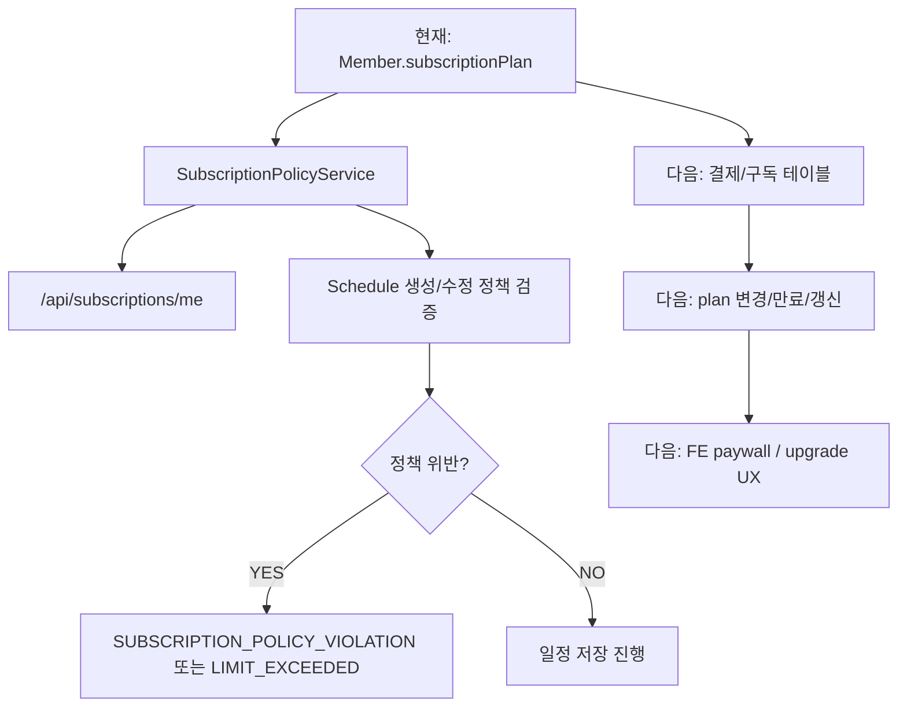

# Subscription / Policy Roadmap

Last verified: 2026-06-17 KST

구독 플랜, 사용량 제한, 알림 정책 제한, 추후 결제/paywall 기능의 상세 로드맵이다.

상위 로드맵:

- [`../roadmap.md`](../roadmap.md)

## Current Status

### 완료

- `SubscriptionPlan`
  - `FREE`
  - `PREMIUM`
- 요금제별 정책 값
  - 월 스마트 일정 생성 한도
  - 최대 알림 리드 타임
  - 최소 알림 주기
  - 최소 ETA 재조회 주기
- `/api/subscriptions/me`
  - 내 구독 정책과 이번 달 사용량 조회
- 일정 알림 설정 검증
  - 알림 리드 타임 제한
  - ETA 조회 간격 제한
  - 월 스마트 일정 한도 제한

### 주요 구현 파일

- `src/main/kotlin/com/noLate/subscription/controller/SubscriptionController.kt`
- `src/main/kotlin/com/noLate/subscription/application/SubscriptionPolicyService.kt`
- `src/main/kotlin/com/noLate/subscription/domain/SubscriptionPlan.kt`
- `src/main/kotlin/com/noLate/subscription/domain/SubscriptionPolicyDto.kt`
- `NoLate_FE/src/api/subscription.ts`

### 테스트

- `src/test/kotlin/com/noLate/subscription/application/SubscriptionPolicyServiceUnitTest.kt`

## Next Work

- 실제 결제/구독 상태 저장 모델
- plan 변경 API
- plan 만료/갱신 처리
- 월 사용량 이력 테이블
- 사용량 reset 기준과 시간대 정책
- 관리자 plan 변경 도구
- FE 구독 정책 조회 후 UI 제한
- FREE 한도 초과 시 paywall
- PREMIUM 기능 차별화 문구/UX
- 구독 정책 변경 시 기존 일정 처리 정책

## Roadmap

<!-- mermaidId: subscription-policy-roadmap -->

## Suggested First Slice

1. 구독 상태 저장 모델 추가
2. FREE/PREMIUM 플랜 변경 API 초안 추가
3. FE에서 `/api/subscriptions/me` 조회 후 알림 설정 제한 표시
4. FREE 한도 초과 시 일정 저장 전에 paywall 표시
5. 정책 위반 응답을 FE에서 사용자 메시지로 변환
